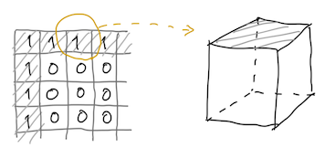
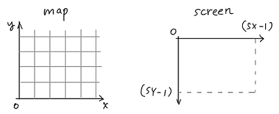
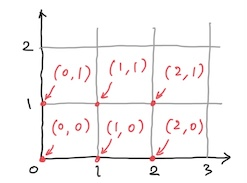
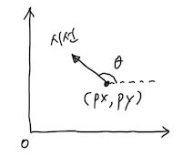
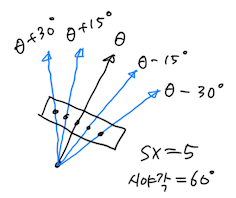

# Ray-casting 1: The World

*Lorem ipsum dolor sit amet* ! (...)

손을 뻗어 주문을 외치며 온 사방에 ~~Rei~~ Ray를 뿌려대기 전에, 우선은 우리가 레이캐스팅으로 나타내려는 이 소박한 가상세계의 모습을 미리 좀 정해둘 필요가 있습니다. 이를테면 모든 벽은 같은 크기의 정육면체(cube)로 되어 있다는 등등의 설정이죠.

현대의 FPS 게임이 그려내는 풍경은 어찌보면 과하다 싶을 정도로 현실성이 있지만, 그 시초라 할 수 있는 울펜3D의 세계는 무척이나 단순합니다.

- 벽과 바닥은 수직이다
- 천장과 바닥은 평평하고, 플레이어 눈높이는 천장과 바닥 사이 딱 중간에 위치한다
- 모든 벽은 같은 크기의 큐브로 이루어져 있다 (이걸 1x1x1 단위라고 하겠습니다)
- 맵은 가로세로 1x1 크기의 격자(grid)로 나타낸다

그러니까 맵에서 벽을 나타낸 격자 한 칸은, 그 벽을 이루는 큐브를 위에서 보고 그린 것과 같다는 얘기죠.

코드에서 맵의 표현은 2차원 `int` 배열을 쓰고, 원소 `map[x][y]`가 `1`이면 벽(을 이루는 큐브), `0`이면 아무것도 없는 통로,라고 정해 두겠습니다.

이것 외에도 풍경을 화면에 그려낼 때 정해야 하는 숫자들이 좀 있는데요, 앞에 나왔던 화면 해상도가 그 중 하나입니다. 사실 해상도는 어떻게 두어도 구현에는 별로 상관이 없어서 (뭐 화면이 크면 그리는 속도가 좀 느려지겠지만..) 가로세로를 각각 SX 및 SY라는 기호로 나타내기로 합니다.

그 다음으로 정해야 할 중요한 숫자는 '시야각'입니다. 영어 field of view의 앞글자를 따서 흔히 FOV라고 쓰는데, 시선을 앞으로 두었을 때 그 좌우로 어느 정도까지 볼 수 있느냐를 나타냅니다. 게임에서는 보통 60도 정도로 둔다고 하네요. 그러니까 시선의 왼쪽으로 30도, 오른쪽으로 30도가 됩니다. 이 역시 고정할 필요는 없으니 기호 $\text{FOV}_\text{H}$로 나타내겠습니다 (H는 수평방향 horizontal).

좌우가 아니라 위아래 수직 방향의 시야각은 어떨까요? 이건 앞서 화면 해상도에서 가로 : 세로의 비율을 정했으니까 거기에 맞추기로 합니다. 수직시야각 $\text{FOV}_\text{V}$는 간단한 비례식으로 계산됩니다.

$$
\begin{array}{l} \text{SX} \ :\  \text{SY} \ =\  \text{FOV}_{\text{H}} \ :\  \text{FOV}_{\text{V}} \\\\ \displaystyle \therefore \  \text{FOV}_{\text{V}} \ =\  \frac{\text{SY}}{\text{SX}}\cdot \text{FOV}_{\text{H}} \end{array}
$$

예컨대 수평시야각 60도에 화면 해상도 720x480 이면, 수직시야각은 다음과 같다고 두는 거죠.

$$
\displaystyle \text{FOV}_{\text{V}} \ =\  \frac{\text{480}}{\text{720}}\times 60^{\circ} \ =\  40^{\circ}
$$

그리고 인터넷의 자료들을 보면 다들 좌표계를 확실히 정해두라고 권하던데, 아마도 수학시간에 배웠던 좌표체계는 1사분면 기준으로 '좌하단'에 (0, 0)이 있어 y축에서 위로 올라갈수록 y값이 커지는 반면, 화면 출력에 사용하는 그래픽스 라이브러리들의 체계는 대개 '좌상단'이 원점이고 y축 아래로 내려갈수록 y값이 커진다는 차이 때문인 듯합니다.

두 좌표를 일치시키면 일부 편해지는 부분이 있겠지만, 습관 땜에 괜히 더 헷갈릴 것 같네요.. 그래서 맵은 수학의 좌표평면처럼 좌하단을 (0, 0)으로, 화면 출력은 좌상단 (0, 0)인 좌표계로 각각 두겠습니다.

한편, 맵에서 벽인지 통로인지는 `map[x][y]`에 담긴 정수 값이 1인지 0인지로 판단하는데, 이 배열의 인덱스는 `map[2][1]`의 2, 1처럼 정수여야 하는 반면에 좌표평면 상의 점들은 (2.4, 1.7) 처럼 실수쌍에 대응됩니다. 그러니 맵 인덱스와 좌표평면을 어떻게 연관시킬지도 미리 정해둘 필요가 있습니다. 이건 정하기 나름이니까, 일단 좌표 (x, y)는 아래 그림처럼 각 성분을 내림해서 (즉 격자의 좌하단으로 끌어내려서) `map[x][y]`라는 원소에 대응되는 걸로 두겠습니다.

예를 들어 플레이어가 좌표 (2.3, 1.1)에 해당하는 곳으로 움직이려 한다고 치죠. 실제로 움직이기 전에 거기가 벽 속인지 통로인지를 알아야 할 텐데, 이때 2.3과 1.1을 각각 내림하여 맵 배열  `map[2][1]`의 원소 값이 1인지 0인지를 보고 판단하자는 겁니다.

그리고 플레이어 위치를 표시하는 방법도 정해 두어야 하겠군요. 맵에서 플레이어의 위치는 좌표 (px, py)로는 충분하지 않죠. 시선을 어디로 두고 있는지에 해당하는 방향각 *θ* 가 더 필요합니다. 플레이어는 맵을 나타내는 좌표평면 위에 있으므로, 이 각도 *θ* 는 시계 반대방향으로 돌 때 증가합니다.

이 상태에서 시험 삼아 빛줄기들을 한번 쫙 뿌려 보겠습니다. 수평시야각이 FOV_H 이고, 화면의 가로 픽셀 수가 SX 이므로, 픽셀 하나에 해당하는 각도는 `FOV_H / SX` …가 되려나요? 아니 잠깐만..

예를 들어 SX = 5 라고 하면 가로 픽셀이 5개니까 레이도 5개 나가야 하는데, 양끝쪽을 생각하면 전체 시야각을 5등분이 아닌 4등분 해야 합니다. 그러니까 ’픽셀과 픽셀 사이의 각도’는 `FOV_H / (SX-1)`이 맞겠군요.

그리고 시선 방향각 *θ* 에다 수평시야각 전체가 FOV_H 니까, 시야각 좌측 끝단의 각도는 *θ* + FOV_H / 2 , 우측 끝단의 각도는 *θ -* FOV_H / 2 라는 것도 명백합니다. 예컨대 시야각이 60° 라면, 시선 방향 기준으로 왼쪽 30° 오른쪽 30°만큼 보인다는 소리죠.

따라서 SX개의 빛줄기 중 *x*번째가 이루는 각의 크기는, 시야각의 좌측 끝단 *θ* + FOV_H / 2 를 기준으로 해서, *x*가 증가하는 만큼 - 즉 시계방향으로 가는 만큼 - 각도를 빼 주면 됩니다. 이것을 수식으로는 아래처럼 쓸 수 있습니다. 물론 이때 *x*는 0 ~ (SX-1) 범위의 정수입니다.

$$
\displaystyle \text{ray}(x) \ =\  \left(\! \theta + \frac{\text{FOV}_\text{H}}{2} \!\right) - \left( \frac{\text{FOV}_\text{H}}{\text{SX}\!-\!1} \right) \times\  x
$$

실제 예를 들어서 위의 식이 어떤 모양이 되나 한번 보죠. 화면 해상도 720 x 480 에 시야각 60° 일 때, 플레이어가 맵의 위쪽을 보는 중이라고 하겠습니다 (즉 *θ* = 90°). 그러면 720개 중 *x*번째의 빛줄기가 수평축에 대해 이루는 각은 다음과 같이 계산됩니다. 좌측 끝단 즉 *x* = 0 일 때 ray(*x*) 값은 120°이고, 우측 끝단 *x* = 719 일 때는 60°가 되네요. 맞는 것 같습니다.

$$
\displaystyle \text{ray}(x) \ =\  ( 90^{\circ} \! + 30^{\circ} ) \,-\, \left( \frac{\,60^{\circ}}{719} \right) \times x
$$

이제 코드 작성에 들어가기 전에, 화면 출력을 위해 어떤 라이브러리를 쓸 것인가를 정해야 하는데요, 필요한 기능이라 해봐야 '점 찍기' 정도라서… 간단히 쓸 수 있는 [SDL](https://www.libsdl.org/)로 낙점하려 합니다. 아, 키 입력 처리도 필요하겠군요.

그럼, 빛을 발사해서 벽을 찾아 볼까요.

[Ray-casting 2: The Wall](02_The_Wall.md)

