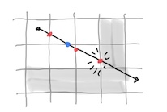
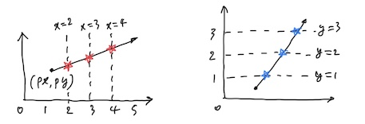
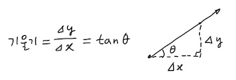
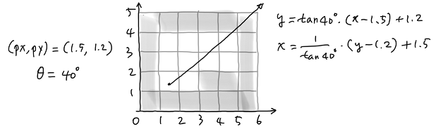
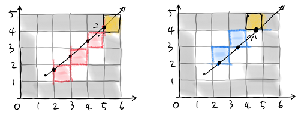
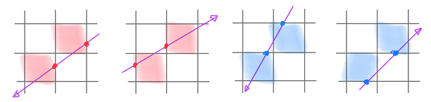
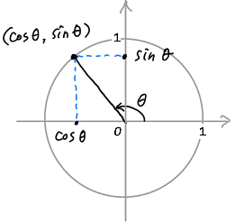
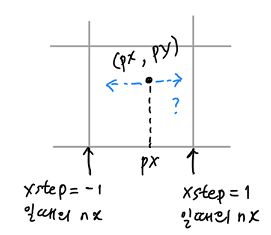

# Ray-casting 2: The Wall

~ Joongbin's [Math Reboot](https://blog.insightbook.co.kr/2020/07/01/《수학-리부트-프로그래머를-위한-기초-수학》/) ~

~ [삼각함수, 벡터 관련 유튜브 강의 클립](https://www.youtube.com/channel/UC3oEhf5Q1WxgwK44Tc80RLw/playlists) ~


(빛줄기로도 치유되지 않는 꿀꿀함이 내려앉는 날에는, “[Run Like Hell](https://youtu.be/j2s8yGMEbSs)”을 크게 틀어 보아요)

# 빛과 벽이 만나는 곳

플레이어 위치가 정해졌고, 여기서 발사되는 빛줄기의 각도 ray(*x*)가 얼마인지도 정해졌습니다. 다음은 이렇게 발사된 *x*번째 빛줄기가 어디 벽에 닿는지를 판정할 차례입니다. 벽은 큐브로 이루어져 있으니, 그 가장자리와 만나면 - 즉 벽을 이루는 '격자'와 만나면 - 닿았다고 할 수 있겠죠.

(이 판정 부분은 자료들에서 흔히 [DDA](https://en.wikipedia.org/wiki/Digital_differential_analyzer_(graphics_algorithm))라는 용어로 설명되는데, 말은 거창해도 사실 중학교때 일차함수 그래프에서 배운 ’x절편’이나 ’y절편’만 알면 어려울 것이 없겠더라고요.)

벽을 찾기 위한 기본적인 아이디어는 이렇습니다. 빛줄기가 뻗어갈 때 격자들과 만나는 점을 잘 감시하다가, 그 격자가 어떤 벽의 테두리라면 그때 벽에 닿았다고 판정하는 겁니다. 아래 그림처럼, 빛이 지나면서 격자와 만날 때마다 그게 벽인지를 보는 거죠.



격자에는 세로선도 있고 가로선도 있습니다. 그림에서 세로선과 만나는 점은 빨갛게, 가로선과 만나는 점은 파랗게 표시되어 있습니다. 만약 빛줄기 발사와 동시에 어떤 벽에 닿는지가 딱 나오는 공식이 있다면 참 좋겠지만, 가능한지도 모르겠고 되더라도 엄청 복잡할 것 같네요. 일단은 빛을 실제로 진행시켜 가면서 교점 하나하나를 살펴보기로 합니다.

격자선 중 세로로 된 것들은 모두 *x*좌표가 일정한 선입니다. 그러니까 *x* = 1, 2, 3, ⋯ 에 해당하는 선들이죠. 마찬가지로 가로선들은 전부 *y*좌표가 일정하며 *y* = 1, 2, 3, ⋯ 에 해당합니다.



이제 빛줄기 하나는 직선이니까 일차함수의 그래프로 볼 수 있습니다 (수직으로 된 직선 같은 특수한 경우는 나중에 따로 처리하기로 합니다). 일차함수는 수식으로 *y* = *f*(*x*) = *ax* + *b* 이죠. 여기서 *a*는 직선의 기울기, 즉 (*y* 변화량 ÷ *x* 변화량)에 해당하므로 삼각함수 중 tan  값을 써서 *a* = tan *θ* 처럼 빛줄기의 방향각으로 간단히 얻을 수 있습니다.



이 직선이 *x* = *k* 라는 세로선과 만나는 점은 어디일까요? 교점의 *x* 좌표는 당연히 *k* 일 테고, *y* 좌표는 *y* = *f*(*x*) = *f*(*k*) 이겠군요. 그러니까 *x* = 1, 2, 3, ⋯ 에 해당하는 세로선들과 이 빛줄기가 만나는 점의 좌표는 (1, *f*(1)), (2, *f*(2)), (3, *f*(3)), ⋯ 이라는 말이 됩니다. 너무 간단해서 어쩐지 속은 느낌인데요.

그럼 가로선의 경우는, 위와 반대로 *y* = *k* 라는 선과의 교점이 될 테니까, *k* = *ax* + *b* 로 두고 *x* 를 구하면 되겠군요. 일차방정식을 풀면 *x* = (*k* − *b*)/*a* 를 얻습니다.

또는, 결과적으로 같은 말이지만 *y* = *ax* + *b* 에서 *x* 와 *y* 의 입장을 바꾼 역함수를 가지고 함숫값으로 구해도 되겠고요.

$$
\displaystyle x \ =\  g(y) \ =\  \small\frac{1}{\ a\ }\normalsize (y-b)
$$

그렇게 역함수로 보면 *y* = 1, 2, 3, ⋯ 에 해당하는 가로선들과 빛줄기의 교점은 (*g*(1), 1), (*g*(2), 2), (*g*(3), 3), ⋯ 이라는 것을 알 수 있습니다. 세로선 때와 반대로 *y* 값이 1, 2, 3으로 먼저 정해지고 거기에 따라서 *x* 좌표가 g(1), g(2), g(3)으로 결정되는 거죠. 또, 역함수 입장에서 봤을 때 이 빛줄기의 기울기는 일차항의 계수, 즉 1/*a* = 1/tan *θ* 로 구해집니다. *x*축과 *y*축의 역할이 바뀌니까요.

실제 예를 하나 들어서 살펴 보겠습니다. 아래 그림과 같은 맵에서 플레이어가 (1.5, 1.2) 위치에 있고 시선방향은 40도라고 합니다. 빛줄기 직선의 식은 어떻게 될까요?

일단 기울기는 tan 40° ≅ 0.839 정도가 되겠죠. 기울기가 *a* 이면서 한 점 (*p*, *q*)를 지나는 직선의 방정식이 아래와 같다는 점을 이용하면, 빛줄기의 식을 쉽게 구할 수 있습니다 (아래쪽은 역함수 꼴).

$$
\begin{array}{l} y  =  a(x-p)+q \\\\[3pt] x  = \frac{1}{\ a\ } (y-q) + p \end{array}
$$



그러면 이 빛줄기가 세로선(*x* = *k*)들과 만나는 점들은 어디일까요? ****빛줄기의 *x*축 진행 방향이 오른쪽(+)이므로, 빛이 나가면서 만나는 세로선은 *x* = 2, 3, 4, ⋯ 등입니다. 그에 따라 세로선과의 교점들을 구해 보면 대략 (2, 1.62),  (3, 2.46),  (4, 3.30) 등과 같습니다. 이 교점들은 맵 배열의 `[2][1]`, `[3][2]`, `[4][3]`이라는 원소에 대응시킬 수 있겠죠. 아래 왼쪽 그림에서 빨간 셀들이 거기에 해당됩니다.



빛줄기가 가로선(*y* = *k*)들과 부딪히는 점의 계산도 다르지 않습니다. *y*축 진행 방향이 위쪽(+)이므로, 빛이 만나게 될 가로선은 *y* = 2, 3, 4, ⋯ 입니다. 따라서 그 교점은 (2.45, 2),  (3.65, 3),  (4.84, 4) 등이 됩니다. 역시 맵 배열로는 `[2][2]`, `[3][3]`, `[4][4]`에 해당되는 파란색의 셀들입니다.

여기서 유의할 것은, 빛의 진행 방향에 따라서 맵의 어느 셀을 검사할지가 달라진다는 점입니다. 위의 그림에서는 빛줄기의 x축 진행 방향이 오른쪽(+)이고, 따라서 벽을 만나면 왼쪽 테두리에 가 닿습니다. 하지만 빛이 왼쪽(-)으로 뻗어가면 어떨까요? 벽의 오른쪽 테두리에 닿을 겁니다.

이럴 때는 인덱스 계산이 달라져야 하겠죠. 예컨대 빛줄기가 왼쪽으로 가다가 세로선과 만난 교점이 (5, 4.14) 라면, 이 점이 속한 셀은 [5][4]가 아니라 [4][4]를 봐야 한다는 식입니다 (아래 그림에서 첫 번째를 보세요). 위아래 진행에 대해서도 마찬가지입니다. 4가지 가능한 경우에 대해 어느 쪽 셀의 값을 보아야 하는지를 아래 그림에 나타냈습니다.



교점이 어느 셀에 속한지를 알게 되었으면, 그걸로 벽에 부딪혔는지 판정할 수 있습니다.

일단 세로선과 만나는 점들부터 살펴 보겠습니다. 저~위의 왼쪽 그림을 보면 *x* = 2, 3, 4 로 나가는 도중에는 벽을 지나지 않습니다. 그러다가 x=5 에서 교점의 좌표가 대략 (5, 4.14) 인데, 이것이 맵 배열의 `map[5][4]`에 대응되고 그 원소 값이 `1` 이므로, 벽에 닿은 거죠.

역시 가로선과 만나는 점을 보면 *y* = 2, 3 까지는 통로를 지나다가 *y*=4 에서 교점 (4.84, 4) → 맵 배열 `map[4][4]`의 값이 1이므로, 벽에 닿았습니다.

이렇게 닿은 두 교점 중에서 플레이어에게 더 가까운 쪽이 진짜로 벽에 닿은 위치겠죠? 저~위의 그림으로 말하면 파란색 쪽, 그러니까 가로선과 만난 교점 (4.84, 4)가 정답입니다. 빨간색 쪽인 세로선의 교점 (5, 4.14)는 훼이크입니다.

이렇게 해서 벽 찾기는 얼추 가능할 것 같습니다. 대략의 로직을 써 보자면 아래처럼 되겠군요.

```c
for( int x=0; x<SX; x++ ) {
    x번째에 해당하는 빛줄기의 각도를 계산한다;
    일차함수의 식을 세운다;
    while( 벽에 안 닿을 동안 )
        빛줄기가 다음 세로선과 만나는 점을 구한다;
    while( 벽에 안 닿을 동안 )
        빛줄기가 다음 가로선과 만나는 점을 구한다;
    벽에 닿은 두 점 중에서 가까운 쪽을 빛줄기가 진짜로 닿는 벽이라 판정한다;
    벽까지의 거리를 계산한다;
    원근법에 따라 벽 세로선의 높이를 계산하여 화면에 그린다;
}
```

위와 같이 가로와 세로방향으로 한 번씩 뻗어 가면서 교점들을 구하는 방식에 별다른 문제가 있는 건 아니지만, 두 방향을 하나로 합친다면 불필요한 계산을 좀 더 줄일 수 있으니 효율적이겠죠. 기존 자료들에서는 이렇게 하는 것을 DDA라고 부르고 있습니다.

```c
    while( 벽에 안 닿을 동안 ) {
        다음번 세로선과 가로선 중 어디가 더 가깝나?
        가까운 쪽을 다음번 교점으로 하고, 벽에 속했는지 검사한다;
    }
```

# 벽을 위한 Code

설명이 길어졌는데요, 코드가 있으면 아무래도 이해하는 데 도움이 좀 될 테니까, 딱 벽만 찾는 코드를 한번 보겠습니다. 이것도 생각보다 길어지더군요.. 그래도 사실 이게 레이캐스팅에서 제일 핵심되는 부분이긴 합니다.

먼저 공통적으로 사용할 몇 가지 매크로와 상수, 타입 등을 정의합니다.

```c
#include <stdio.h>
#include <stdlib.h>
#include <math.h>

#define  EPS            (1e-06)
#define  is_zero(d)     (fabs(d) < EPS)
#define  deg2rad(d)     ((d)*M_PI/180.0)    /* degree to radian */
#define  rad2deg(d)     ((d)*180.0/M_PI)    /* radian to degree */
#define  min(a,b)       ((a)<(b)? (a):(b))
#define  max(a,b)       ((a)>(b)? (a):(b))

#define  SX         3       /* screen width */
#define  FOV        10      /* field of view (in degree) */
#define  FOV_H      deg2rad(FOV)

static const double ANGLE_PER_PIXEL = FOV_H / (SX-1.);
static const double FOVH_2 = FOV_H / 2.0;

enum { VERT, HORIZ };

typedef enum { false=0, true=1 } bool;
typedef enum { DIR_N=0, DIR_E, DIR_W, DIR_S } dir_t;
```

`EPS`나 `is_zero()` 를 쓰는 이유는 부동소숫점(floating poing) 실수가 0인지 알아보는 것이 정수와 다르기 때문인데요, 더 자세한 것은 'IEEE 754'와 'machine epsilon' 같은 키워드로 인터넷 검색을 해 보시기를 권합니다.

`deg2rad`는 각도를 도(degree) 단위에서 라디안(radian) 단위로 바꾸는 매크로입니다. 고등학교 수학 '일반각과 호도법'이란 단원에 나오는 바로 그겁니다. C언어 math 라이브러리에서 제공되는 수학 함수는 전부 라디안 단위를 가정하거든요.

SX는 화면 가로해상도이자 빛줄기의 개수를 나타내는데, 테스트하려고 일단 3으로 둡니다. 시야각 FOV도 10도로 두었습니다. 이렇게 하면 시선방향과 좌우 ±5도로 해서 레이가 모두 3개 나가겠죠. 나머지는 대충 보면 뭔지 아실 것들입니다.

다음은 맵을 `int`의 배열로 정의합니다. C의 이중 배열을 쓸 때는 인덱스 순서에 주의를 기울여야 하는데, 여기서는 x와 y 순서로 쓰기로 합니다. 그리고 그냥 map[x][y]처럼 배열에 직접 접근하면 인덱스가 잘못되었을 때 방어가 불가능하므로, 맵의 셀에는 `map_get_cell` 이라는 함수를 통해서 접근하기로 합니다. 이 코드 부분은 나중에 map.c 같은 별도 파일로 빼서 `map`이란 배열의 존재 자체를 숨겨둘 필요가 있습니다.

```c
#define  MAPX   6
#define  MAPY   5

static int map[MAPX][MAPY] = {  /* warning: index order is [x][y] */
    {1,1,1,1,1}, /* [0][*] */
    {1,0,0,0,1}, /* [1][*] */
    {1,0,0,0,1}, /* [2][*] */
    {1,1,0,0,1}, /* and so on... */
    {1,1,0,0,1},
    {1,1,1,1,1}
};

int
map_get_cell( int x, int y )
{
    return (x >= 0 && x < MAPX && y >= 0 && y < MAPY) ? map[x][y] : -1;
}
```

그 외 유틸리티성 함수도 몇 개 정의해 둡니다. `sgn()`은 실수를 받아서 그 부호(sign)를 +1, 0, -1 중 하나로 돌려주는데, 이 때 0인지 검사하기 위해 `is_zero` 매크로를 씁니다. 이렇게 하면 예를 들어 0.00000005 처럼 '거의 0인' 숫자를 0으로 취급할 수 있습니다.  `l2dist()`는 흔히 말하는 두 점 간의 '거리'를 계산하는데, 함수 이름은 그 '거리'(유클리드 거리)를 뜻하는 $\text{L}_2$ distance에서 땄습니다.

```c
int
sgn( double d )
{
    return is_zero(d) ? 0 : ((d > 0) ? 1 : -1);
}

double
l2dist( double x0, double y0, double x1, double y1 )
{
    double dx = x0 - x1;
    double dy = y0 - y1;
    return sqrt(dx*dx + dy*dy);
}
```

이제, `main` 함수부터 top-down으로 살펴 볼까요. 프로그램의 인자로는 플레이어의 위치와 시선방향을 받기로 하겠습니다. 각각 x좌표, y좌표, 방향각입니다.

인자를 처리한 다음에는 맵을 한번 출력해 줍니다. 2중 배열의 특성상 x와 y 인덱스 순서가 사람이 인지하는 것과는 조금 다르기 때문에, 실제 좌표평면상에서 어떤 모양이 되는지 확인하는 차원입니다.

그리고 메인 루프가 나오는데, 이것은 앞서 언급되었던 x = 0 부터 (SX-1) 까지 빛줄기를 쏘는 과정에 해당합니다. `cast_single_ray()`라는 함수가 빛줄기 한 개 쏘는 일을 맡습니다.

```c
int
main( int ac, char** av )
{
    if( ac != 4 ) {
        fprintf(stderr,"usage: %s x y th(deg)\n", av[0]);
        exit(1);
    }
    double px, py, th;
    px = atof(av[1]);
    py = atof(av[2]);
    th = deg2rad(atof(av[3]));

    /* print map */
    for( int y=MAPY-1; y>=0; y-- ) {
        for( int x=0; x<MAPX; x++ ) {
            printf("%c ", (map_get_cell(x,y)==1 ? '#':'.'));
        }
        putchar('\n');
    }

    for( int x=0; x<SX; x++ ) {
        double wdist = cast_single_ray(x, px, py, th);
        printf("** ray %3d : dist %.2f\n", x, wdist);
    }

    return 0;
}
```

한 단계 내려가서 빛줄기 하나를 쏘는 함수를 살펴 보겠습니다. 아직까지는 간단해 보이네요.

일단 `ray`라는 변수의 값은 현재의 `x`값에 따른 빛줄기의 각도를 앞 글에서 설명한 그대로 계산하고 있습니다. `ANGLE_PER_PIXEL` 역시 앞서 설명한 대로 FOV_H / (SX-1) 을 뜻합니다.

$$
\displaystyle \text{ray}(x)  =  \left(  \theta + \frac{\text{FOV}_\text{H}}{2}  \right) - \left( \frac{\text{FOV}_\text{H}}{\text{SX} - 1} \right) \times  x
$$

그리고 정작 중요한 교점 계산은 다시 `get_wall_intersection()` 이라는 함수를 호출하는군요. 이 함수를 호출할 때는 빛줄기 각도 ray와 플레이어의 위치 px 및 py를 입력으로 주고, 출력으로는 벽에 닿은 맵 상의 위치 wx 및 wy, 벽에 닿은 방향 wdir의 값을 받아옵니다.

```c
double
cast_single_ray( int x, double px, double py, double th )
{
    double ray = (th + FOVH_2) - (x * ANGLE_PER_PIXEL);

    dir_t wdir;     /* direction of wall */
    double wx, wy;  /* coord. of wall intersection point */

    if( get_wall_intersection(ray, px, py, &wdir, &wx, &wy) == false )
        return INFINITY; /* no intersection - maybe bad map? */

    double wdist = l2dist(px, py, wx, wy);

    return wdist;
}
```

이제 벽 찾기의 핵심 함수를 보겠습니다. 이것이 말하자면 DDA 알고리즘의 구현체에 해당하겠군요. 얘는 세로와 가로를 같이 처리하다 보니 아무래도 좀 긴데요, 코드 중간중간 `/* comment */` 도 적어 두었으니 참고해 주세요.

처음 나오는 `xstep`과 `ystep`의 계산에 왜 삼각함수가 나오는지는 설명이 좀 필요하겠네요. 이 두 개의 변수는 ray라는 각도대로 빛을 쏠 때, *x*축과 *y*축 방향으로 증가할지/감소할지/꼼짝말지 여부를 나타냅니다. 예를 들어 ray가 270°라면 *x*축은 제자리에, *y*축은 (-)방향으로 감소해야겠죠. 이런 경우 xstep = 0, ystep = -1 이 됩니다.

그렇다면 이런 부호값은 어떻게 알 수 있을까요? 삼각함수를 정의할 때 단위원 상의 한 점은 (cos *θ*, sin *θ*) 로 나타낼 수 있고, 이때 *x*좌표의 부호는 cos *θ*, *y*좌표의 부호는 sin *θ* 의 부호와 같다는 점을 이용합니다. 이건 빛줄기의 각도만 알면 바로 나오는 값이죠.
이것을 코드로 나타내면 `sgn( cos(ray) )` 및 `sgn( sin(ray) )` 처럼 됩니다.



중요한 변수 몇 개만 더 설명해 보겠습니다. 우선 `nx`, `ny`는 (px, py)에서 출발한 빛이 다음 번에 도달할 *x* 및 *y*좌표이고, 초기 값은 xstep과 ystep에 따라 정해집니다. 아래 그림은 nx의 경우에 대해 설명하고 있는데, ny의 경우도 마찬가지입니다.



`f`, `g`는 각각 빛줄기 직선을 나타내는 일차함수와 그 역함수의 함숫값입니다.

- *f*(*x*)는 수직선이 아닌 경우, 즉 xstep != 0일 때 의미가 있습니다. xstep = 0 이라면 수직선이고 이때 기울기 `xslope` = tan *θ* 는 ±∞ 로 undefined 입니다.
- 역함수 *g*(*y*)는 반대로 수평선 아닐 때, 즉 ystep != 0 일 때 정의됩니다. 역시 ystep = 0 이라면 기울기 `yslope` = (1/tan *θ*) 가 undefined 입니다.
- 수평선이나 수직선이어서 기울기가 정의되지 않을 경우 `f`나 `g`의 값은 초기값인 `INFINITY`(∞)에서 변화가 없습니다. ∞로 두는 것은 거리를 비교할 때 수평선이나 수직선에게 항상 의문의 1패를 주기 위함입니다.

위의 함숫값을 이용해서 격자와의 교점까지 거리를 잰 결과가 `dist_v`와 `dist_h` 입니다. 얘들은 플레이어 위치 (px, py)에서 빛줄기를 쐈을 때 nx와 ny로 나타내어지는 '다음 번' 격자의 세로선이나 가로선 - 즉 (nx, *f*(nx)) 또는 (*g*(ny), ny) 까지의 거리에 해당됩니다.

거리를 비교한 다음에는, 더 가까운 쪽의 교점을 택해서 그 점이 속한 맵 인덱스를 `mapx`와 `mapy`로 얻어냅니다. 이때 진행방향에 따라 4가지 경우가 생긴다는 점에 유의해야 하고요. 이 맵 배열의 원소 값이 `1`이면 벽에 닿은 것이므로, 교점 좌표와 충돌 방향 등 출력 인자의 값을 설정하고 루프를 빠져나갑니다.

끝으로 `while` 루프의 마지막에서, 어느 쪽 격자에 맞았는지 여부에 따라 `nx` 또는 `ny`를 일정 step만큼 변화시킨다는 점에 주목할 필요가 있습니다. 가로나 세로 방향 중 가까운 쪽으로'만' 1칸 전진시키는 거죠.

여기까지가 DDA를 ~~맘대로~~ 나름대로 구현한 코드의 대략적인 설명입니다.

```c
bool
get_wall_intersection( double ray, double px, double py, dir_t* wdir, double* wx, double* wy )
{
    int xstep = sgn( cos(ray) );  /* +1 (right), 0 (no change), -1 (left) */
    int ystep = sgn( sin(ray) );  /* +1 (up),    0 (no change), -1 (down) */

    double xslope = (xstep == 0) ? INFINITY : tan(ray);
    double yslope = (ystep == 0) ? INFINITY : 1./tan(ray);

    double nx = (xstep > 0) ? floor(px)+1 : ((xstep < 0) ? ceil(px)-1 : px);
    double ny = (ystep > 0) ? floor(py)+1 : ((ystep < 0) ? ceil(py)-1 : py);

    printf("\nray=%.2f deg, xstep=%d, ystep=%d, xslope=%.2f, yslope=%.2f, nx=%.2f, ny=%.2f\n",
        rad2deg(ray), xstep, ystep, xslope, yslope, nx, ny);

    double f=INFINITY, g=INFINITY;
    bool hit = false;
    int hit_side; /* either VERT or HORIZ */

    while( !hit )
    {
        int mapx, mapy;

        if( xstep != 0 ) f = xslope * (nx-px) + py;
        if( ystep != 0 ) g = yslope * (ny-py) + px;

        /* which is nearer to me - VERT(nx,f) or HORIZ(g,ny)? */
        double dist_v = l2dist(px, py, nx, f);
        double dist_h = l2dist(px, py, g, ny);

        if( dist_v < dist_h ) { /* VERT is nearer; go along x-axis */
            mapx = (xstep == 1) ? (int)(nx) : (int)(nx)-1 ;
            mapy = (int) f;
            hit_side = VERT;
            printf(" V(%d, %.2f) ->", mapx, f);
        }
        else {  /* HORIZ is nearer; go along y-axis */
            mapx = (int) g;
            mapy = (ystep == 1) ? (int)(ny) : (int)(ny)-1 ;
            hit_side = HORIZ;
            printf(" H(%.2f, %d) ->", g, mapy);
        }
        int cell = map_get_cell(mapx, mapy);
        if( cell < 0 ) break;   /* out of map */

        if( cell == 1 ) {   /* hit wall? */
            if( hit_side == VERT ) {
                *wdir = (xstep > 0) ? DIR_W : DIR_E;
                *wx = nx;
                *wy = f;
            }
            else { /* HORIZ */
                *wdir = (ystep > 0) ? DIR_S : DIR_N;
                *wx = g;
                *wy = ny;
            }
            hit = true;
            printf(" hit wall!\n");
            break;
        }

        if( hit_side == VERT ) nx += xstep;
        else ny += ystep;
    }
    /* end of while(!hit) */

    return hit;
}
```

위 코드를 컴파일할 때는 C math library 정도만 `-lm` 으로 같이 링크해 주면 됩니다. 실행을 시키면 아래에서 보듯이 벽에 닿을 때까지 빛을 전진시키면서 어느쪽 방향의 격자선에 (V/H로 표시) 부딪혔는지 좌표와 함께 출력합니다. 프로그램의 동작 이해를 위해 인자 값이나 맵의 내용 등을 이리저리 바꿔 가면서 실험해 보는 것도 좋겠네요.

```
shell $ cc -o ex01 -Wall ex01.c -lm
shell $ ./ex01 1.5 3.5 355
# # # # # #
# . . . . #
# . . . . #
# . . # # #
# # # # # #

ray=360.00 deg, xstep=1, ystep=0, xslope=-0.00, yslope=inf, nx=2.00, ny=3.50
 V(2, 3.50) -> V(3, 3.50) -> V(4, 3.50) -> V(5, 3.50) -> hit wall!
** ray   0 : dist 3.50

ray=355.00 deg, xstep=1, ystep=-1, xslope=-0.09, yslope=-11.43, nx=2.00, ny=3.00
 V(2, 3.46) -> V(3, 3.37) -> V(4, 3.28) -> V(5, 3.19) -> hit wall!
** ray   1 : dist 3.51

ray=350.00 deg, xstep=1, ystep=-1, xslope=-0.18, yslope=-5.67, nx=2.00, ny=3.00
 V(2, 3.41) -> V(3, 3.24) -> V(4, 3.06) -> H(4.34, 2) -> V(5, 2.88) -> hit wall!
** ray   2 : dist 3.55
```

다음 글에서는 이렇게 알아낸 벽의 모습을 실제로 화면 상에 그려 보겠습니다.

&#8592; [Ray-casting 1: The World](01_The_World.md)

&#8594; [Ray-casting 3: The Height](03_The_Height.md)

