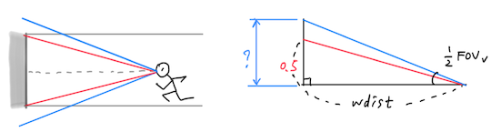
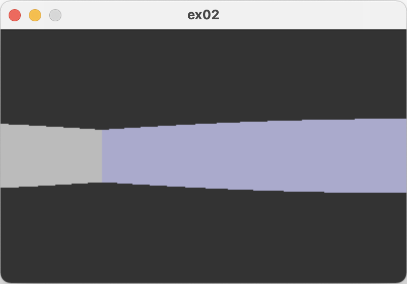
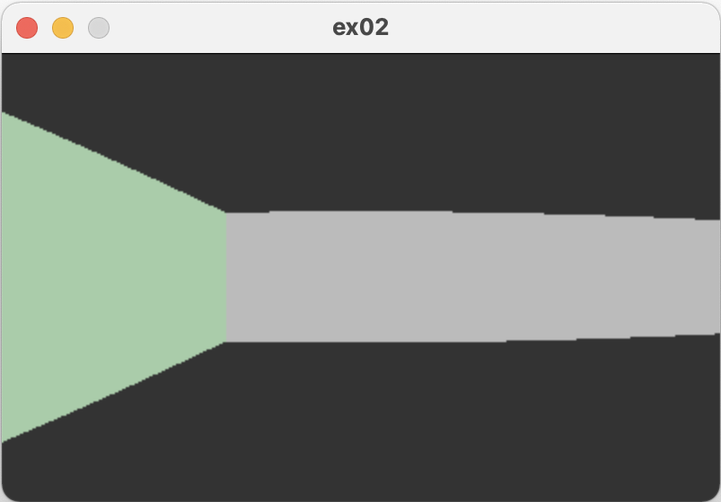
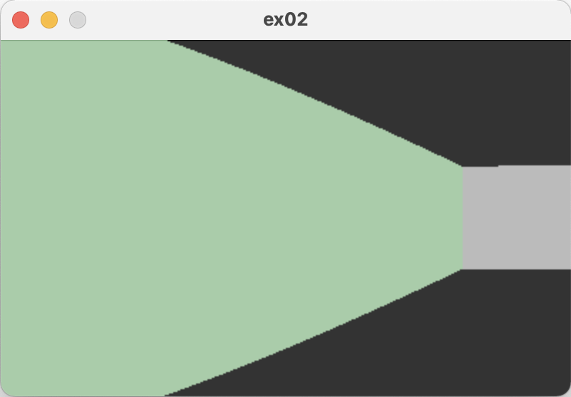
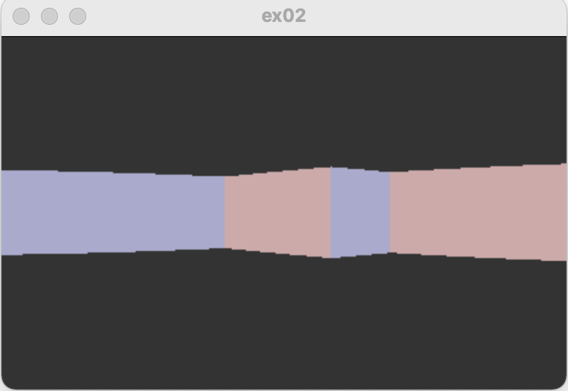

# Ray-casting 3: The Height

~ Joongbin's [Math Reboot](https://blog.insightbook.co.kr/2020/07/01/《수학-리부트-프로그래머를-위한-기초-수학》/) ~

~ [삼각함수, 벡터 관련 유튜브 강의 클립](https://www.youtube.com/channel/UC3oEhf5Q1WxgwK44Tc80RLw/playlists) ~

# 그래픽스 !

화면에 실제로 뭔가를 그리려면 그래픽스 라이브러리를 통해야 하죠. 필요한 기능도 몇 개 없으니, 대충 SDL 위에 얇게 한겹 씌워서 아래와 같은 형태로 만들어 쓰기로 합니다. 이렇게 하면 혹시 나중에 SDL이 아닌 다른 라이브러리를 쓸 때도 수정을 최소화할 수 있을 겁니다. 아마도..

```c
void* gr_init( int w, int h, const char* title );
void gr_finish( void* );

void gr_flush( void* );

int gr_clear( void*, int color );
int gr_vline( void*, int x, int y0, int y1, int color );

int gr_waitkey( void* );
```

그래픽스용 구조체는 쓰는 입장에서 내용을 굳이 알 필요 없으므로 일반적인 포인터(void*)로 퉁치기로 합니다. `gr_init()`로 초기화하면서 받아온 그 `void*`를 가지고 선을 그리는 등 이런저런 일을 시킨 다음, 다 썼으면 `gr_finish()`에 넣어서 반환시키는 식입니다.

`gr_clear()`는 주어진 색으로 화면 전체를 칠하고, `gr_vline()`은 세로줄 하나를 그립니다. `gr_waitkey()`는 아무 키나 눌릴 때까지 기다립니다.

색상 표현은 0xRRGGBB 형식의 정수입니다. 따라서 RGB 각 색깔은 `0x00` ~ `0xff` 의 범위를 가집니다. 흰색은 `0xffffff`, 검은색은 `0x000000` 입니다.

`gr_flush()`는 뭐하는 거지 싶을 수도 있는데요, 지금까지의 변경사항을 실제로 화면에 그리라는 명령입니다. 이 밑에는 더블 버퍼링(double buffering)이라는 개념이 깔려 있죠. 자세한 것은 검색 ㄱㄱ..

# 원근법의 수학

앞의 글에서 빛줄기 하나를 쏴서 부딪히는 벽의 위치와 그 거리를 얻었죠. 그 다음은 원근법에 바탕해서 해당 벽(사실은 세로줄)을 화면에 그릴 차례인데요. 이 세로줄은 대체 얼마만한 크기로 그려야 할까요?

화면의 세로 해상도는 `SY` 였습니다. 화면을 이루는 하나의 column 안에 SY개의 픽셀이 있다는 뜻이죠. SY와 밀접하게 연관된 수량으로는 수직방향 시야각(FOV_V)이 있습니다. 그 시야각에 해당하는 만큼의 영역이 SY개의 픽셀로 화면에 표현되는 것이니까요.

이 전체 (수직)시야각이 나타내는 높이와 벽 하나의 높이(=1)가 어떤 비율인지를 알면, 벽을 화면에 그릴 수 있습니다. 예를 들어 전체 시야각에 해당하는 높이가 4로 계산되었다면, 벽은 항상 높이가 1이므로 화면의 1/4 에 해당하고, 따라서 SY/4개 만큼의 픽셀로 세로줄을 그리면 됩니다. 명확하네요!

아래의 왼쪽 그림을 한번 보겠습니다. 파랗게 표시된 각도 범위는 수직시야각 FOV_V을 나타냅니다. 플레이어가 볼 수 있는 최대 영역이죠. 이 상태에서 회색의 저 '벽'은, 플레이어가 떨어진 거리에 따라 화면 가득히 차고 넘치게 보일 수도 있고, 멀리 떨어진 점 하나로 보일 수도 있겠죠. 이렇게 벽을 바라본 각의 크기가 빨간 선으로 표시되어 있습니다.



여기서 시선방향의 위쪽 절반만 떼어 보면 오른쪽 그림과 같이 됩니다. 빨간색의 벽 높이는 원래의 절반이므로 0.5 크기일 텐데, 수직시야각의 절반에 해당하는 저 파란색 선의 높이는 얼마나 될까요? 이것만 알면 전체 화면 속에서 저 벽이 차지하는 비율을 따져서 세로선을 그릴 수 있을 겁니다.

그림을 보니 각도와 거리를 하나씩 알고 있고, 직각삼각형이 그려져 있네요. 직각삼각형 하면 피타고라스 정리 아니면 삼각비죠. 각도가 나왔으니 삼각비를 동원해 봅니다. 파란색 선이 빗변인 삼각형을 봐 주세요.

파란색 높이를 *H* 라고 하면, '탄젠트'의 정의에 따라 다음이 성립합니다. 이때 밑변인 *d* 는 (앞에서 얻었던) 벽까지의 거리 `wdist`를 뜻합니다.

$$
\begin{array}{l} \tan \left( \frac{1}{2}  \text{FOV}_{\text{V}} \right) = \displaystyle\frac{H}{d}\textstyle \\\\[10pt] \therefore\  H \ =\  d\cdot \tan \left( \frac{1}{2}  \text{FOV}_{\text{V}} \right) \end{array}
$$

식이 뭔가 복잡해 보이지만, 사실 tan 어쩌고 하는 부분은 고정된 값을 갖습니다. 일종의 상수죠. 따라서 *H* 와 *d* 는 "단순한 비례 관계"입니다. 즉, "거리 *d* 가 멀수록 시야의 높이 *H* 는 커진다"는 거죠. (그림에서 d를 늘려 가며 생각하면 당연함을 느낄 수 있습니다.) 그에 비해서 0.5라는 고정된 크기를 가진 벽의 상반부는 그 화면 속에서 점점 작아지고요.

예를 들어 수직시야각이 40°이고 벽까지의 거리가 3 이라면, *H* = 3 × tan 20° ≅ 1.092 정도가 됩니다. 그러니 시야(1.092)에서 벽(0.5)이 차지하는 비율은 대략 절반 정도가 되겠네요. 이제 거리를 늘려서 10 정도로 잡아 보면, *H* = 10 × tan 20° ≅ 3.64 쯤이고, 전체 시야에서 벽은 대략 1/7 로 많이 작아 보이게 됩니다.

지금은 시선방향 위쪽 절반만 보고 있었는데요, 범위를 전체 수직시야각으로 다시 돌려 보겠습니다. 그러면 벽의 높이는 1 이고, 파란 높이는 2*H* 가 됩니다. 파란 높이가 화면 픽셀로는 SY개에 해당하니까, 간단한 비례식으로 벽의 높이를 픽셀 단위로 구할 수 있습니다. 구하는 높이를 *w* 라고 하면,

$$
\begin{array}{c} 1  :  2H \ =\  w  :  \text{SY} \\\\[5pt] \therefore\  w \ =\  \displaystyle \frac{\text{SY}}{2H} \ =\  \frac{\text{SY}}{2d\cdot \tan \left( \frac{1}{2}  \text{FOV}_{\text{V}} \right)} \end{array}
$$

복잡해보이는 겉모습에 속지 마세요. 저 분모에 있는 tan 어쩌고는 상수입니다. 분자의 SY도 상수고요. 그러니까 이것은 "*w* 는 *d* 와 반비례한다"는 단순한 사실을 말해주는 수식입니다. "거리가 멀수록 벽을 나타내는 픽셀 수도 줄어든다"는 내용이죠. 다만 화면에 그리려면 정확한 픽셀 개수를 알아야 하니까, 이런저런 상수가 붙어서 복잡해보이는 식이 나오게 된 겁니다.

앞의 예를 다시 들어서, 수직시야각 40° 이고 벽까지의 거리가 *d* = 10인 경우를 볼까요. 화면의 세로해상도는 SY=200이라고 가정하겠습니다. 그러면 이 벽을 그릴 픽셀 수는,

$$
w \ =\  \frac{200}{2\cdot 10\cdot \tan 20^{\circ}} \ =\  \frac{200}{7.2794\cdots} \ \approx\  27.47
$$

...로부터 27개라는 것을 알 수 있습니다. 픽셀은 정수여야 하니까요.

벽이 되게 가까이 있어서 거리 *d* = 1 인 상황은 어떨까요? 아마도 화면을 꽉 채우고 남을 텐데요. 한번 계산해 보겠습니다.

$$
w \ =\  \frac{200}{2\cdot 1\cdot \tan 20^{\circ}} \ =\  \frac{200}{0.72794\cdots} \ \approx\  274.7
$$

274 픽셀이니까 화면의 세로 크기 200을 초과하네요. 이런 경우는 화면 크기만큼만 보여주도록 위아래 남는 부분을 끊어내야 하겠죠(clipping).

이렇게 벽을 그리는 내용을 이제 코드로 나타내어 보겠습니다. 벽 찾는 부분까지는 바뀐 것이 없으므로, 앞 글에 나왔던 코드의 많은 부분을 재사용할 수 있습니다. 일단 화면 해상도 부분은 현실적으로 400 x 250 정도로 정해 둡니다.

```c
#define  SX         400     /* screen width */
#define  SY         250     /* screen height */
#define  FOV        60      /* field of view (in degree) */
#define  FOV_H      deg2rad(FOV)
#define  FOV_V      (FOV_H*(double)SY/(double)SX)
#define  WALL_H     1.0
```

중요하지 않은 부분은 적당히 생략하고, 메인 루프 위주로 봅니다.

```c
int
main( int ac, char** av )
{
    /* ... 중간생략 ... */
    void* gr = gr_init(SX, SY, "ex02");
    gr_clear(gr, 0x000000);

    for( int x=0; x<SX; x++ ) {
        dir_t wdir;
        double wdist = cast_single_ray(x, px, py, th, &wdir);
        draw_wall(gr, wdist, x, wall_colors[wdir]);
    }
    gr_flush(gr);
    gr_waitkey(gr);

    gr_finish(gr);
    return 0;
}
```

즉, `cast_single_ray`에서 얻어온 벽까지의 거리 `wdist`를 가지고, 이번에 추가될 함수 `draw_wall` 에서 화면에 실제로 그리는 거죠. 추가된 함수를 한번 보겠습니다.

```c
int
get_wall_height( double dist )
{
    double fov_h = 2.0 * dist * tan(FOV_V/2.0);
    return (int)(SY * (WALL_H / fov_h)); /* in pixels */
}

void
draw_wall( void* gr, double wdist, int x, int color )
{
    int wh = get_wall_height(wdist);    /* wall height, in pixels */

    /* starting/ending y pos of the wall slice */
    int y0 = (int)((SY - wh)/2.0);
    int y1 = y0 + wh - 1;

    /* needs clipping */
    int ystart = max(0, y0);
    int yend = min(SY-1, y1);

    gr_vline(gr, x, ystart, yend, color);
}
```

앞에서 비례식으로 벽의 픽셀 높이를 계산했던 수식이 `get_wall_height`라는 함수 안에 얌전히 그대로 들어앉아 있습니다. 아주 간단한 두 줄의 문장이지만, 그 수식이 나온 과정을 모르고 보는 사람에게는 암호문이나 다를 바 없겠죠...

아래쪽의 함수 `draw_wall` 에서는 이렇게 얻어낸 벽의 픽셀 높이 `wh`를 가지고 화면상의 시작 위치 `y0`와 끝 위치 `y1`을 계산합니다. 그냥 화면 가운데에서 위아래로 같은 길이가 되도록 그리는 겁니다. 하지만 이렇게 나온 y0와 y1은 화면을 벗어날 수 있으므로, `0`과 `SY-1` 범위 안에 있도록 잘라(clipping) 줍니다.

그리고 남은 일은 그 좌표에다가 선을 그리는 것 뿐이죠.

이렇게 해서 정말 벽이 그려지냐고요? 맵의 가운데 공간만 조금 늘리고 이리저리 위치를 바꿔가며 이 코드를 실행시킨 스크린샷이 아래에 있습니다.









# 거리 보정

위의 그림에서 뭔가 이상한 점을 느끼셨나요? 무릇 벽이란 곧아야 하거늘... 어쩐 일인지 특수렌즈로 찍은 것마냥 휘어져 보여 마음이 불-편 하네요. 뭐가 문제일까요?

앞서 벽까지 거리를 계산할 때, 그 중심에는 플레이어의 시점이 있었죠. 이 시점은 좌표상에서 한 점으로 나타나니까, 아래의 왼쪽 그림처럼 시야 가장자리로 갈수록 눈으로부터의 거리가 더 멀어지는 결과를 가져 옵니다.

하지만 우리는 벽을 '화면'에 나타내야 하므로, 한 점에서 떨어진 거리가 아니라 (시선방향에 수직인) 평면과 벽 사이의 거리를 잴 필요가 있습니다. 이것이 오른쪽 그림에서 말하는 내용입니다.


그렇다면 삐딱하게 계산된 거리를 바로잡을 방법은 무엇일까요? 여기서 다시 삼각비를 써먹습니다. 아래 그림처럼 어떤 빛줄기에 대해 계산된 거리를 *l* , 실제로 화면에 나타내야 할 거리(빨간색)를 *m* 이라고 하죠. 그러면 회색 빛줄기가 시선방향에 대해 벌어진 각도를 β 라고 할 때, '코사인'의 정의에 의해 아래와 같은 (다행히도 간단한) 관계가 성립합니다.


그러므로, 우리가 할 일은 계산된 거리 `wdist` 에다가 현재 레이의 벌어진 각도의 코사인 값 cos β 를 곱해 주는 것 뿐입니다. 와우!

게다가 cos 함수는 우함수(even function)라서 cos(-x) = cos(x) 가 성립하죠. 그러니 시선방향과 레이의 각도 중 아무것이나 골라서 남은 각도를 빼고 cos을 계산해 주면 됩니다. 즉, cos(ray - *θ*) 를 하든지 cos(*θ* - ray) 를 하든지 마찬가지라는 거죠.

코드에서는 `l2dist`로 거리를 계산한 다음 아래와 같이 cos 값을 곱해 주기만 하면 됩니다.

```c
double
cast_single_ray( int x, double px, double py, double th, dir_t* pdir )
{
    /* ... 중간생략 ... */

    double wdist = l2dist(px, py, wx, wy);
    wdist *= cos(th - ray);  /* 보정 */

    /* ... 이하생략 ... */
```

그 결과는 아래와 같습니다. 아까 것과 비교해 보죠. 코사인 하나 곱했을 뿐인데...


다음 글에서는 키보드로 플레이어의 위치와 방향을 바꿔 가면서 다이나믹하게 화면을 그려 보겠습니다.

&#8592; [Ray-casting 2: The Wall](02_The_Wall.md)

&#8594; [Ray-casting 4: The Player](04_The_Player.md)

