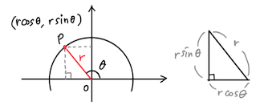
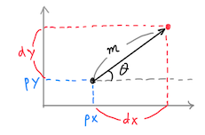
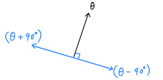
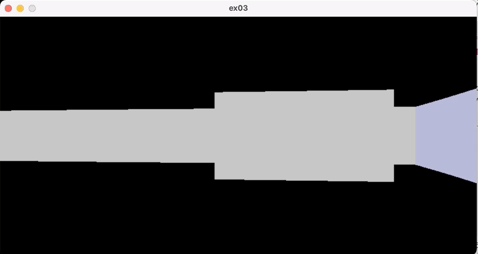

# Ray-casting 4: The Player

~ Joongbin's [Math Reboot](https://blog.insightbook.co.kr/2020/07/01/《수학-리부트-프로그래머를-위한-기초-수학》/) ~

~ [삼각함수, 벡터 관련 유튜브 강의 클립](https://www.youtube.com/channel/UC3oEhf5Q1WxgwK44Tc80RLw/playlists) ~

이제 시점을 움직여 가며 던전을 탐험할 시간입니다! 플레이어의 움직임은 아래의 두 종류를 가정하겠습니다.

- WASD 키 : 시선방향(*θ*)을 고정한 채 위치(x, y)를 이동
- ← → 키 : 위치는 고정한 채 시선방향만 좌우로 회전

둘 중에서 회전은 고민할 거리가 없습니다. 현재 각도 *θ* 만 바꾸면 되죠. 다만, 관리 차원에서 숫자가 0° ~ 360° 범위를 벗어나는 경우 다시 그 안으로 집어넣는 정도는 해 주는 편이 좋습니다. 안 그러면 회전 몇 번에 각도가 천 단위를 찍을 테니까요..

WASD 이동의 경우는 약간의 산수가 필요합니다. 먼저, 앞 글의 어디선가 단위원과 함께 언급했던 삼각함수의 정의를 조금 확장해 보겠습니다. 원점 *O* 에서 거리 *r* 만큼 떨어진 점 *P* 가 있고, *OP* 가 *x* 축과 이루는 각이 *θ* 이라면, 이 점의 좌표를 (*r* cos *θ*, *r* sin *θ*) 처럼 쓸 수 있습니다. 이건 피타고라스 정리로도 증명이 됩니다 (sin² *θ* + cos² *θ* = 1).



이제 플레이어가 (px, py)에 있고 시선방향각이 *θ* 일 때, '앞쪽'으로 *m* 만큼 움직이려 합니다.



그러면 *x* 축과 *y* 축 방향으로 이동해야 할 거리는 각각 dx = *m* cos *θ*, dy = *m* sin *θ* 처럼 쓸 수 있겠죠. 따라서 이동 후의 좌표 (nx, ny)는 현재 위치의 좌표 (px, py)에다가 (dx, dy)만큼을 더한 것과 같습니다. 반대로 뒷걸음질 칠 때는 현재 좌표에서 (dx, dy)만큼을 각각 빼 주면 됩니다.

이 두 경우를 수식으로 써 봅니다. 복부호(±) 중 + 부호는 W키, - 부호는 S키에 해당합니다.

$$
\left\{ \begin{array}{l} \text{nx} \ =\  \text{px} \ \pm\  m \cos\theta \\\\ \text{ny} \ =\  \text{py} \ \pm\  m \sin\theta \end{array} \right.
$$

그렇다면, 옆으로 게걸음 하는 경우는 어떨까요?



그림에서 알 수 있듯이, 이 게걸음은 앞뒤로 움직일 때와 기본적으로 같고 방향만 90° 차이납니다. A키를 누르면 *θ* + 90° 에 해당하는 방향으로, D키를 누르면 *θ -* 90° 방향으로 *m* 만큼 이동하면 됩니다.

$$
\left\{ \begin{array}{l} \text{nx} \ =\  \text{px} \ +\  m \cos \ (\theta \pm 90^{\circ}) \\\\ \text{ny} \ =\  \text{py} \ +\  m \sin \ (\theta \pm 90^{\circ}) \end{array} \right.
$$

지금까지 본 내용을 코드에 실제로 반영해 보겠습니다.

먼저 몇 가지 정의를 추가합니다. `ROT_UNIT`은 ← 또는 → 키를 한 번 누를 때 회전할 각도를, `MOVE_UNIT`은 WASD 키를 한 번 누를 때 움직일 거리를 나타냅니다. `player_t`는 플레이어의 위치와 방향각을 담기 위한 구조체입니다. `KEY_`로 시작하는 값들은  `gr_readkey()` 함수가 키 하나를 읽어서 이 enum 중 하나로 리턴해 주도록 합니다.

```c
#define  _2PI       6.28318530717958647692  /* 2 * M_PI */

#define  ROT_UNIT   0.03    /* rad */
#define  MOVE_UNIT  0.1

enum { KEY_OTHER, KEY_W, KEY_A, KEY_S, KEY_D, KEY_LEFT, KEY_RIGHT, KEY_ESC };

typedef struct {
    double x;
    double y;
    double th;
} player_t;
```

이제 `main` 함수부터 변경되는 부분 위주로 살펴 보겠습니다 (편의상 오류처리나 맵 출력 등은 생략). 이전 코드와 비교하면 player_t 구조체의 사용, 키 입력 받기 정도가 눈에 띄고, 벽을 찾아서 그려주는 부분은 `render()`라는 함수로 따로 뺐습니다.

```c
void
render( void* gr, player_t* pp )
{
    static int wall_colors[] = {    /* DIR_N, E, W, S */
        0x00ccaaaa, 0x00aaccaa, 0x00aaaacc, 0x00bbbbbb
    };
    gr_clear(gr, 0x000000);

    for( int x=0; x<SX; x++ ) {
        dir_t wdir;
        double wdist = cast_single_ray(x, pp, &wdir);
        draw_wall(gr, wdist, x, wall_colors[wdir]);
    }
    gr_flush(gr);
}

int
main( int ac, char** av )
{
    player_t pl;
    pl.x = atof(av[1]);
    pl.y = atof(av[2]);
    pl.th = deg2rad(atof(av[3]));

    void* gr = gr_init(SX, SY, "ex03");
    render(gr, &pl);

    /* main loop */
    for(;;) {
        int key = gr_readkey(gr);
        if( key < 0 || key == KEY_ESC ) {   /* quit */
            break;
        }
        if( key == KEY_LEFT || key == KEY_RIGHT ) {
            player_rotate(&pl, ROT_UNIT * (key==KEY_LEFT ? 1 : -1));
            render(gr, &pl);
        }
        else if( key == KEY_W || key == KEY_A || key == KEY_S || key == KEY_D ) {
            if( player_move(&pl, key, MOVE_UNIT) == 0 ) {
                render(gr, &pl);
            }
        }
    }
    gr_finish(gr);
    return 0;
}
```

main loop 내에서는 키보드 입력에 따른 동작을 취합니다. ← 나 → 키가 눌렸을 때는 `player_rotate()`가 호출되죠. 거기서 ← 키의 경우 `ROT_UNIT` 만큼 (즉 시계반대방향), → 키의 경우 `-ROT_UNIT` 만큼 (즉 시계방향) 회전이 일어난 다음에, `render()`를 호출하여 화면을 다시 그립니다.

회전 함수 `player_rotate()`의 구현은 아주 간단한데요, 주어진 각도만큼 플레이어의 시선방향각을 변화시키기만 하면 됩니다. 각도 증감분 `th`의 값은 `ROT_UNIT`이나 `-ROT_UNIT` 중 하나겠죠. 그 아래 두 줄은 각도 범위를 0 ~ 360° 사이로 맞추는 코드이고, 상수 `_2PI` 는 2π (rad) = 360°를 뜻합니다.

```c
void
player_rotate( player_t* pp, double th )
{
    pp->th += th;
    if( pp->th < 0 ) pp->th += _2PI;
    else if( pp->th > _2PI ) pp->th -= _2PI;
}
```

WASD 키가 눌렸을 때는 `player_move()`가 호출됩니다. 눌린 키에 따라서 이동 방향을 정하고, 그 방향에 따른 이동 offset을 계산하고, 목적지가 혹시 벽 속은 아닌지 (최소한의 충돌 방지!) 확인한 다음에 실제로 플레이어 위치를 옮겨 갑니다.

각 방향별 offset을 다시 정리하면 아래와 같습니다.

- `W` : ( +*m* cos *θ* , +*m* sin *θ* )
- `S` : ( -*m* cos *θ* , -*m* sin *θ* )
- `A` : ( *m* cos(*θ*+90°), *m* sin(*θ*+90°) )
- `D` : ( *m* cos(*θ*-90°), *m* sin(*θ*-90°) )

```c
static int
get_move_offset( double th, int key, double amt, double* pdx, double* pdy )
{
    switch( key ) {
        case KEY_W:
        case KEY_S:
            *pdx = (key==KEY_W ? 1 : -1) * amt * cos(th);
            *pdy = (key==KEY_W ? 1 : -1) * amt * sin(th);
            break;
        case KEY_A:
        case KEY_D:
            *pdx = amt * cos(th + (key==KEY_A ? 1 : -1) * M_PI_2);
            *pdy = amt * sin(th + (key==KEY_A ? 1 : -1) * M_PI_2);
            break;
        default: /* invalid */
            return -1;
    }
    return 0;
}

int
player_move( player_t* pp, int key, double amt )
{
    double dx=0, dy=0;
    double nx, ny;

    if( get_move_offset(pp->th, key, amt, &dx, &dy) < 0 ) {
        fprintf(stderr,"player_move: invalid key %d\n", key);
        return -1;
    }
    nx = pp->x + dx;
    ny = pp->y + dy;

    if( map_get_cell((int)nx, (int)ny) != 0 ) {
        printf("** bump !\n");
        return -1;
    }
    pp->x = nx;
    pp->y = ny;
    return 0;
}
```

참고로, `M_PI_2` 라는 기호는 <math.h>에 정의된 상수로 π/2 값을 나타내며, 위 코드에서는 π/2 (rad) = 90°를 뜻합니다.

이렇게 만든 코드를 돌려 보았습니다. 좀 어지럽지만... 이제야 뭔가 게임 느낌이 나는군요!



&#8592; [Ray-casting 3: The Height](03_The_Height.md)

&#8594; [Ray-casting 5: The Texture](05_The_Texture.md)

