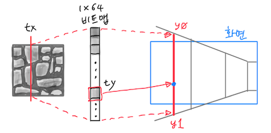

# Ray-casting 5: The Texture (feat. Lumi)

~ Joongbin's [Math Reboot](https://blog.insightbook.co.kr/2020/07/01/《수학-리부트-프로그래머를-위한-기초-수학》/) ~

~ [삼각함수, 벡터 관련 유튜브 강의 클립](https://www.youtube.com/channel/UC3oEhf5Q1WxgwK44Tc80RLw/playlists) ~


앞 글에서 플레이어의 움직임에 따라 단색으로나마 벽을 그려 보았습니다. 큰 맵에다가 여기저기 벽을 만들고 돌아다니는 것도 나름 중독성 있죠... 하지만 벽이 너무 밋밋하네요. 알록달록한 텍스쳐를 입혀 보기로 합니다.

원래 울펜3D에 사용된 텍스쳐는 돌벽이나 나무판자 등의 모양이고, 아직 저작권이 걸려 있긴 하지만 인터넷에서 쉽게 찾을 수 있습니다. 이 텍스쳐들은 모두 64 x 64 크기인데, 이런 비트맵을 벽에 입히려면 어떻게 해야 할까요?

벽이 정면 앞쪽에 평평하게 놓여 있다면, 텍스쳐 비트맵을 벽 크기에 맞도록 확대·축소시키는 걸로 충분하겠죠. 하지만 우리 앞에 놓인 벽들은 거리와 각도가 제각각이라, 벽을 이루는 세로줄을 하나씩 계산해서 그려야 하는 상황입니다.

그렇게 세로줄로 벽을 그린다면, 그 줄이 텍스쳐에는 어디쯤 대응되는지 - 즉 텍스쳐 비트맵의 어느 세로줄에 대응되는지 계산하면 되지 않을까요? 예를 들어 아래 왼쪽 그림처럼 어떤 벽 하나를 그리는데, 저 빨간색으로 표시한 부분의 세로줄을 막 그릴 참이라고 하겠습니다.


이 상황을 가운데 그림처럼 맵 좌표로 생각해 보죠. 위에서 본 그림입니다. 빛줄기가 벽에 닿는 교점 (wx, wy)를 앞 글에서는 직선의 함숫값으로 얻어냈습니다. 빛줄기가 벽을 친 방향은 아래 → 위라 가정하고요. 이때 예를 들어 교점의 *x* 좌표값 `wx`가 7.35 라고 하면, 해당 셀 왼쪽 경계선의 *x* 좌표는 7이 됩니다. 맵의 격자 경계선은 좌표가 모두 정수니까요. 그리고 이건 7.35에서 소숫점 이하를 떼어 버린 ⌊7.35⌋= 7, 즉  `floor(wx)`와도 같습니다.

따라서 교점은 셀의 왼쪽 끝에서 7.35 - ⌊7.35⌋ = 0.35 만큼 떨어져 있습니다. 다른 말로, 저 세로선은 해당 벽에서 35% 위치에 있다고도 할 수 있습니다. 벽을 친 방향이 위 → 아래일 경우에도 마찬가지입니다. 이걸 식으로 쓰면 `wx - floor(wx)`가 되겠네요.

하지만 맵에서 좌 → 우 또는 우 → 좌 처럼 빛줄기가 벽의 옆구리를 쳤다면 계산이 조금 달라져야 합니다. 이때는 교점의 *x* 좌표가 아니라 *y* 좌표를 봐야 할 테고, 식으로 쓰면 `wy - floor(wy)`가 됩니다. 맵 좌표에서는 위로 가면서 *y* 좌표값이 증가하죠.


참고로, 여기까지 wx 나 wy 를 설명하던 그림들은 모두 지형을 위에서 본, 맵 관점이라는 것에 유의할 필요가 있습니다.

이렇게 해서 벽의 세로줄이 텍스쳐에서는 어느 세로줄 - 즉 *x* 좌표에 대응되는지 알았습니다. 예컨대 텍스쳐 비트맵의 너비가 64 라면, 우리가 관심을 가질 *x* 좌표의 값 `tx`는 벽을 친 방향에 따라 `(int)( 64 * (wx - floor(wx)) )` 또는 `(int)( 64 * (wy - floor(wy)) )` 가 됩니다.

남은 것은 *y* 좌표입니다. 이 계산은 벽을 단색 선으로 그릴 때와 비슷한데요, 화면상에서 (벽이 그려질 시작점 `ystart`와 끝점 `yend` 사이의) 각 *y* 좌표에 대응되는 텍스쳐의 *y* 좌표 값 `ty`를 비례식으로 구할 수 있습니다.  비례식은 간단하니까 한번 직접 구해 보시는 걸로...

tx와 ty가 정해졌으므로, 드디어 텍스쳐 비트맵에서 (tx, ty) 위치에 있는 픽셀의 색상 값을 얻어옵니다. 이게 바로 지금 화면에 해당 텍스쳐를 나타내기 위해 찍어야 할 점의 색상이죠. 아래 그림이 지금까지의 내용을 나타내고 있습니다.



물론 이 비트맵들은 화면 바깥의 것들은 제외하고 화면 안에 들어오는 경우만 처리합니다.

일단 여기까지의 내용을 코드로 한번 나타내어 볼까요. 텍스쳐 이미지를 미리 로딩하거나, 메모리를 반환하는 등의 구체적인 것들은 일단 좀 냅두겠습니다. 그래도 아래 정도의 내용은 짚어 두는 편이 좋겠군요..

```c
/* for textures */
typedef struct {
    int w, h;
    char* name;
    void* sfc;  /* SDL specific image data */
} img_t;

int gr_img_getpixel( img_t*, int x, int y );
int gr_putpixel( void*, int x, int y, int color );
```

텍스쳐의 정보는 `img_t` 라는 구조체로 감싸는데, 여기에 픽셀 단위로 너비(`w`)나 높이(`h`)를 같이 기억해 둡니다. 그리고 어떤 텍스쳐 비트맵의 (x, y)에 위치한 픽셀의 색상 값을 얻는 것은 `gr_img_getpixel()` 로 합니다. `gr_putpixel()`은 점 하나를 찍는 함수입니다.

이제 텍스쳐를 입혀 보겠습니다.

앞서 단색으로 벽을 그릴 때, 실제 화면을 구성하는 것은 `draw_wall()` 함수 안의 아래와 같은 코드였습니다. 여기에는 세로선의 *x* 좌표, 세로선의 높이에 따른 시작점(ystart)과 끝점(yend), 벽의 색깔(color)이 들어 있습니다.

```c
    gr_vline(gr, x, ystart, yend, color);
```

텍스쳐를 사용하는 경우 이 코드는 아래와 같이 변경됩니다.

`texture_get()`은 미리 로드해 놓은 동서남북 4가지의 서로 다른 벽 텍스쳐 중 하나를 가져오는데, 이때 벽을 친 방향 `wdir`에 해당하는 걸로 고릅니다.

그 다음엔 벽에 닿은 지점의 좌표로부터 `tx`를 먼저 계산하고, 화면에 그릴 *y* 범위에 따라 `ty`를 계산한 다음, 비트맵에서 (tx, ty)에 위치한 픽셀의 색상을 얻어 화면의 (x, y) 위치에 점을 찍습니다.

```c
    img_t* ptex = texture_get(wdir);
    double txratio = (wdir == DIR_W || wdir == DIR_E) ? (wy-floor(wy)) : (wx-floor(wx));
    int tx = (int)(txratio * ptex->w); /* texture col # */

    for( int y=ystart; y<=yend; y++ ) {
        int ty = (int)((double)(y-y0) * ptex->h / wh); /* texture row # */
        int color = gr_img_getpixel(ptex, tx, ty);
        gr_putpixel(gr, x, y, color);
    }
```

실행해 보면 이런 화면이 나옵니다. 단색으로 그릴 때보다 뭔가 더 있어 보이네요. 천정과 바닥이 새까만 것이 눈에 거슬리지만, 이건 다음 글에서 잘 칠해 보도록 하겠습니다.


# The Luminosity

텍스쳐까지 숨차게 달려왔는데요, 잠깐 옆길로 새어 볼까요.. 큰 힘 안들이고 약간이나마 현실적인 느낌을 더할 수 있는 '조명 효과'를 적용해 보겠습니다.

조명이라고 해야 거창한 건 아니고, 가까운 것은 지금처럼 밝게, 멀리 떨어질수록 좀 더 어둡게 그려 주는 겁니다. 빛의 세기는 거리의 제곱에 반비례한다는 물리 법칙이나, 무슨 광원이 어디에 몇 개나 있는지 등을 따지자면 너무 복잡하겠죠. 레이-캐스팅이 아니라 레이-트레이싱이 될지도... 여기서는 단순히 거리가 멀어질 때 밝기는 선형적으로 감소한다고 해두겠습니다.

다만 감소하는 정도는 맵의 크기를 고려하는 것이 좋을 듯합니다. 예컨대 20 x 30 크기의 맵에서는 가로세로의 평균인 25 정도 떨어진 거리부터 밝기가 0이 되는 걸로 정하는 거죠. 뭐, 이건 취향에 따라 적당히 바꾸면 되는 부분입니다.

```c
double
get_luminosity( double dist )
{
    static double D = -1;
    if( D < 0 ) D = (map_xmax() + map_ymax())/2.0;
    return (dist > D) ? 0 : (1. - dist/D);
}
```

위의 함수는 거리 `dist`에 따라 0 ~ 1 사이의 값을 돌려줍니다. `map_xmax()`나 `map_ymax()`는 `MAPX`와 `MAPY`에 해당하는 값을 얻는 부분이고, static 변수 사용이 좀 이상해 보이는 것은 중복계산을 줄이고 C const의 제약을 피해보려는 꼼수입니다.

그러면 어떤 임의의 색상을, 예를 들어 70%의 밝기로 낮추려면 어떻게 할까요? 해당 색을 구성하는 R, G, B 값에 각각 0.7을 곱해 주면 되죠. 이것을 코드로 나타내 보겠습니다. 여기서는 int 하나로 나타내는 color 값과 R, G, B 개별 색상값을 오가며 변환하는 함수 `decode_color()`와 `encode_color()`가 있다고 가정합니다.

```c
int
fade_color( int color, double lum )
{
    if( lum < 0 ) lum = 0;
    else if( lum > 1 ) lum = 1;
    int r, g, b;
    decode_color(color, &r, &g, &b);
    return encode_color( (int)(r*lum), (int)(g*lum), (int)(b*lum) );
}
```

위의 두 함수를 조합하면, 거리에 따라서 임의의 색상을 fade 시킬 수 있습니다. 예를 들어 텍스쳐를 그릴 때 그냥 (tx, ty)의 색깔로 화면에 점을 찍지 않고, 벽의 거리에 따라 조정된 밝기를 적용하려면 아래와 같이 하면 됩니다.

```c
    double lum = get_luminosity(wdist); /* 0과 1 사이 */

    /* ... 텍스쳐 (tx, ty)에 있는 색상을 fade 시킴 */
    int color = fade_color(gr_img_getpixel(ptex, tx, ty), lum);
```

아래는 단색으로 그린 경우의 스크린샷입니다.


이건 텍스쳐를 입혔을 때입니다. 조금 더 그럴듯해졌군요.


다음은, 천정과 바닥 차례입니다.

&#8592; [Ray-casting 4: The Player](04_The_Player.md)

&#8594; [Ray-casting 6: The Floor](06_The_Floor.md)

