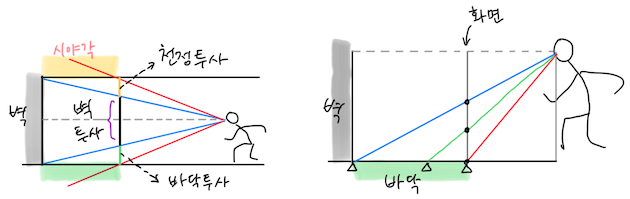
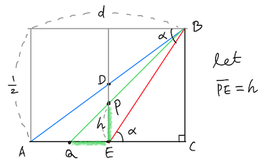
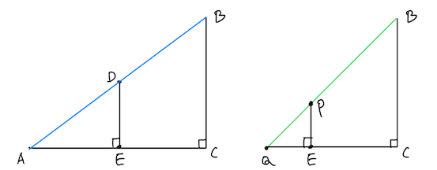
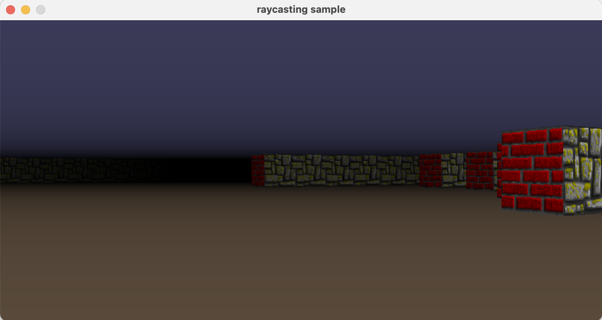
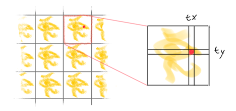
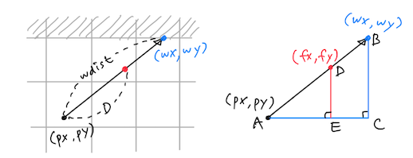
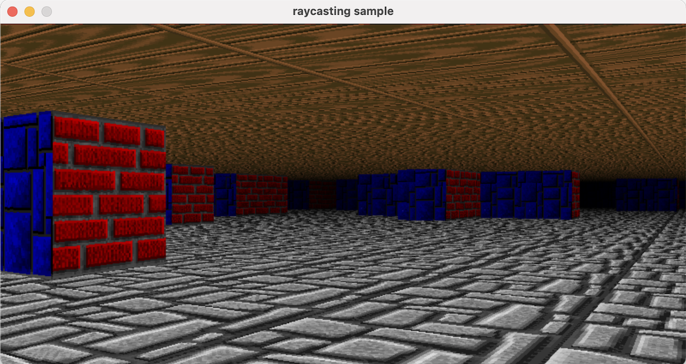

# Ray-casting 6: The Floor

~ Joongbin's [Math Reboot](https://blog.insightbook.co.kr/2020/07/01/《수학-리부트-프로그래머를-위한-기초-수학》/) ~

~ [삼각함수, 벡터 관련 유튜브 강의 클립](https://www.youtube.com/channel/UC3oEhf5Q1WxgwK44Tc80RLw/playlists) ~

천정과 바닥은 계산이 약간 복잡한 편입니다. 사칙연산으로 커버 가능한 범위지만요. 복잡한 이유는, 천정과 바닥을 이루는 점들이 (벽과 달리) 모두 거리가 다르면서 그 변화가 선형적이지도 않기 때문입니다. 말로 하니 좀 어려워 보이는데요, 아래 그림을 한번 보시죠..



플레이어가 벽을 바라보고 있습니다. 저 벽을 화면에 그리게 되면, 벽 위아래로 남은 공간은 각각 천정과 바닥에 대응이 되겠죠. 일단은 바닥 쪽만 고려하겠습니다 (천정은 바닥과 상하 대칭으로 그리면 되니까요).

오른쪽 그림처럼, 벽이 끝나는 곳에서부터 아래쪽으로, 화면 하단에 이를 때까지 바닥을 쭉 그립니다. 이때 바닥이 그려진 화면의 가운데쯤을 보면, 화면에서는 중간이지만 실제 대응되는 바닥은 플레이어쪽으로 약간 더 가까운 지점입니다. 대충 봐도 화면과 바닥의 실제 거리가 선형적으로(일차함수로) 대응되지는 않아 보이죠. 그럼 얘네들은 어떤 식으로 대응이 될까요?

화면의 픽셀과 바닥점의 실제 거리 사이의 관계는, 다행히 도형의 닮음비 개념을 써서 계산이 가능합니다. 위의 상황을 도식화해서 한번 그려 보겠습니다.



그림에서 각 *ɑ* 는 수직시야각 FOV_V의 절반에 해당하고, 나머지 점들의 의미는 앞의 그림과 맞춰 보면 바로 알 수 있습니다. 또한 벽의 높이가 1 이니까 선분 *BC* 의 길이는 벽의 절반인 1/2 이고, *AC* 의 길이는 벽까지의 거리 *d* 에 해당합니다. 삼각함수를 쓰면 *EC* 의 길이도 나옵니다. 앞서 [The Height](Ray-casting%203%20The%20Height%20421cb7ed93524f29bfab22ffd380dbb5.md) 에서 유사한 수식을 다룬 적이 있었죠.

$$
\begin{array}{l} \displaystyle \tan\alpha = \frac{\overline{BC}}{\  \overline{EC}\ } = \frac{1}{\  2\overline{EC}\ } \\\\[5pt] \displaystyle \therefore\  \overline{EC} \ =\  \frac{1}{\  2\tan\alpha\ } \end{array}
$$

우리가 궁금한 것은, 화면 하단(*E*)에서 픽셀 *P* 까지의 간격 *h* 가 변할 때, 해당 픽셀이 나타내는 바닥의 위치 *Q* 까지의 거리 *QC* = *QE* + *EC* 가 어떻게 되느냐 하는 것입니다. 이때 맵 좌표에서 1 이라는 거리는 화면에서 SY 픽셀에 해당하므로, 픽셀 단위 크기를 SY로 나누면 맵 좌표상의 *h* 크기를 구할 수 있습니다.

어쨌거나 위에서 *EC* 는 방금 구했으니까, 바닥을 그리기 위해서는 *QE* 만 구하면 되겠네요. 즉, 우리가 해결할 문제는 다음과 같습니다.

<aside>
⚠️   $h=\overline{PE}$ 가 변함에 따라 $\overline{QE}$ 는 어떻게 변하는가?

</aside>

문제 해결을 위해 "삼각형의 닮음비"로부터 도움을 받기로 합니다. 일단 그림에 숨어 있는 직각삼각형들을 좀 보겠습니다.



왼쪽 큰 삼각형에서 선분 *DE* 의 길이는 어떻게 구할까요? 그림을 가만 보면, △*ABC* 와 △*ADE* 가 닮은꼴이라는 걸 알 수 있습니다. 그러므로 닮음비의 성질에 의해 다음이 성립합니다.

$$
\begin{array}{rcl} \overline{DE} \ :\  \overline{BC}    & = &    \overline{AE} \ :\  \overline{AC} \\\\[2pt] \textstyle\overline{DE} \ :\  \large\frac{1}{2}    & = &    (d-\overline{EC}) \ :\  d \\\\[2pt] \therefore \overline{DE}   & = &    \displaystyle \frac{d-\overline{EC}}{2d} \end{array}
$$

비슷하게, 오른쪽 삼각형에서도 다음 식이 성립합니다. 여기는 모르는 수량이 두 개네요. *QE* 랑 *h*.

$$
\begin{array}{rcl} \overline{PE} \ :\  \overline{BC}    & = &    \overline{QE} \ :\  \overline{QC} \\\\[3pt] \textstyle h \ :\  \large\frac{1}{2}    & = &    \overline{QE} \ :\  (\overline{QE} + \overline{EC}) \\\\[3pt] \textstyle \large\frac{1}{2}\normalsize\ \overline{QE}    & = &    h\cdot \overline{QE} \ +\  h\cdot \overline{EC} \\\\[3pt] \textstyle (\large\frac{1}{2}\normalsize - h)\cdot\overline{QE}    & = &    h\cdot \overline{EC} \end{array}
$$

식을 *QE* 에 대해서 정리하면... 마참내 (*fimally*!) *QE* 를 *h* 의 함수로 나타낼 수 있습니다.

$$
\begin{array}{rl} \overline{QE}    & \displaystyle =\  \frac{h}{(\frac{1}{2} - h)}\cdot \overline{EC} \ =\  \frac{h}{(\frac{1}{2} - h)}\cdot\frac{1}{2\tan\alpha} \\\\[10pt] \therefore\  \overline{QE}   & \displaystyle =\  \frac{1}{\tan\alpha}\cdot\frac{h}{(1  -  2h)} \end{array}
$$

탄젠트 쪽은 상수지만, 함수 자체는 유리함수 꼴이군요. 역시 예상대로 만만한 일차함수 따위가 아니었어..

이제 할 일은, 화면을 그릴 때 픽셀 위치에 따른 *h* 값과 그에 따른 *QE* 의 길이를 얻은 다음, 바닥까지의 거리 (*QE* + *EC*)에 대응되도록 단색 점을 찍거나 텍스쳐를 그리는 겁니다. 이 거리를 *D*(*h*)라고 하고, 총정리 삼아 전부 한번 풀어 써 보죠.

$$
\begin{array}{rl} D(h)    & \displaystyle =\  \overline{QE} + \overline{EC} \\\\[3pt] & \displaystyle =\  \frac{1}{\tan\alpha}\cdot \frac{h}{(1  -  2h)} \ +\  \frac{1}{2\tan\alpha} \\\\[9pt] & \displaystyle =\  \frac{1}{\tan\alpha}\left[ \frac{h}{(1  -  2h)} + \frac{1}{\ 2\ } \right] \\\\[9pt] & \displaystyle =\  \frac{1}{\tan\alpha}\cdot \frac{1}{2\cdot(1  -  2h)} \\\\[9pt] & \displaystyle =\  \frac{1}{2\tan\alpha}\cdot \frac{1}{(1  -  2h)} \end{array}
$$

제법 아름답게(?) 나왔군요. 이 식을 코드에 반영하기만 하면 됩니다. 거리에 따라 단색으로 점을 찍는 코드가 아래에 있습니다. 물론 코드의 위치는 벽을 그린 다음이고요.

바닥에 점 찍는 김에 천정에도 찍어 줍니다. 천정은 바닥 점(`y`)을 화면 가운데 기준으로 상하대칭시킨 위치(`SY-1-y`)에 그냥 찍으면 됩니다. ㄱ이득이네요.

```c
    if( y1 < SY-1 ) {
        double EC = get_fov_min_dist();

        for( int y=y1+1; y<SY; y++ ) {
            double h = (double)(SY-1-y)/SY;
            double D = EC / (1. - 2*h);
            double lum_f = get_luminosity(D);

            gr_putpixel(gr, x, y, fade_color(COLOR_FLOOR, lum_f)); /* 바닥 */
            gr_putpixel(gr, x, (SY-1-y), fade_color(COLOR_CEIL, lum_f)); /* 천정 */
        }
    }
```

참, `get_fov_min_dist()` 는 아래와 같이 정의되어 있습니다. const에는 tan 함수를 못 써서...

```c
double
get_fov_min_dist() /* distance to the floor-FOV intersection point */
{
    static double T = -1;
    if( T < 0 ) T = WALL_H / (2.0 * tan(FOV_V/2.0));
    return T;
}
```

스크린샷입니다. 거리가 멀어지면서 바닥과 천정도 침침해지는 것이, 어떤 그윽함마저 느껴지는군요.



이게 끝은 아닙니다. 아직 할 일이 남았죠.. 텍스쳐를 입혀 보겠습니다.

# Floor Texturing

바닥/천정의 텍스쳐는 비트맵이 격자에 딱딱 맞춰서 그려져야 합니다. 그것은 곧, 맵에서 어떤 바닥점의 좌표만 알면 거기에 해당하는 텍스쳐 비트맵 내의 위치 (tx, ty)도 바로 알 수 있다는 것입니다.



그렇다면, 지금 찍고 있는 바닥점의 좌표는 어떻게 알 수 있을까요? 아래 왼쪽 그림과 같은 상황을 가정해 보겠습니다. 플레이어가 (px, py) 위치에 있고, 빛줄기를 쏘았더니 (wx, wy) 좌표에서 벽과 부딪혔습니다. 그 벽(의 세로줄)을 잘 그려준 다음에 이제 바닥 중에서 저기 빨간 점으로 표시된 곳을 막 그리려고 합니다. 빨간 점의 좌표를 구하는 방법은 뭘까요?



빨간 점의 좌표를 (fx, fy) 라 두고 위의 상황을 도식화해보면 오른쪽 그림처럼 됩니다. 어쩐지 익숙해 보이는.. 닮은꼴이 나왔군요. 직각삼각형에서 밑변과 높이는 좌표들의 x 성분이나 y 성분의 차로 구하면 될 것 같고, 빗변의 길이는.. 그것도 이미 알고 있죠. *AB* = wdist = *d* 이고, *AD* = *D*(*h*) 입니다. 앞서 구했던 바로 그 *D*(*h*) 말입니다. 

그렇다면, 우선 빗변과 밑변(*x* 좌표 측면)에 닮음비를 적용해 보겠습니다.

$$
\begin{array}{rcl} AD \ :\  AB   & = &   AE \ :\  AC \\\\[3pt] D(h) \ :\  d   & = &   (\mathrm{fx} - \mathrm{px}) \ :\  (\mathrm{wx} - \mathrm{px}) \\\\[3pt] d \cdot (\mathrm{fx} - \mathrm{px})   & = &   D(h) \cdot (\mathrm{wx} - \mathrm{px}) \\\\[3pt] \therefore\  \mathrm{fx}    & = &   \displaystyle \frac{D(h)}{d} \cdot (\mathrm{wx} - \mathrm{px}) \ +\  \mathrm{px} \end{array}
$$

음, 좋아 보이네요. 다음은 빗변과 높이(*y* 좌표 측면) 차례입니다.

$$
\begin{array}{rcl} AD \ :\  AB   & = &   DE \ :\  BC \\\\[3pt] D(h) \ :\  d   & = &   (\mathrm{fy} - \mathrm{py}) \ :\  (\mathrm{wy} - \mathrm{py}) \\\\[3pt] \therefore\  \mathrm{fy}    & = &   \displaystyle \frac{D(h)}{d} \cdot (\mathrm{wy} - \mathrm{py}) \ +\  \mathrm{py} \end{array}
$$

이렇게 해서 빨간 점의 좌표를 구했습니다. 이제는 벽의 텍스쳐 때와 유사하게 소수점 떨이 방법 `fx - floor(fx)` 등을 동원해서 대응되는 비트맵 내의 위치 tx 및 ty를 구할 수 있습니다. 아래 코드에서 fx, fy, tx, ty의 계산 부분을 찾아 보세요.

```c
    double EC = get_fov_min_dist();

    for( int y=y1+1; y<SY; y++ ) {
        double h = (double)(SY-1-y)/SY;
        double D = EC / (1. - 2*h);
        double lum_f = get_luminosity(D);

#ifdef NO_TEXTURE
        gr_putpixel(gr, x, y, fade_color(COLOR_FLOOR, lum_f));
        gr_putpixel(gr, x, (SY-1-y), fade_color(COLOR_CEIL, lum_f));
#else
        double d_ratio = D / wdist;
        double fx = pp->x + (wx - pp->x) * d_ratio; /* floor coord. */
        double fy = pp->y + (wy - pp->y) * d_ratio;

        /* floor */
        img_t* ptex = texture_get(DIR_S+1);
        int tx = (int)((fx-floor(fx)) * ptex->w); /* texture col # */
        int ty = (int)((fy-floor(fy)) * ptex->h); /* texture row # */
        gr_putpixel(gr, x, y,
                    fade_color(gr_img_getpixel(ptex, tx, ty), lum_f) );

        /* ceiling */
        ptex = texture_get(DIR_S+2);
        tx = (int)((fx-floor(fx)) * ptex->w); /* texture col # */
        ty = (int)((fy-floor(fy)) * ptex->h); /* texture row # */
        gr_putpixel(gr, x, (SY-1-y),
                    fade_color(gr_img_getpixel(ptex, tx, ty), lum_f) );
#endif
    }
```

이것으로 그윽함에 텍스쳐를 더해 보았습니다.



자, 이제 아이템(스프라이트)만 보여 주면 됩니다!

&#8592; [Ray-casting 5: The Texture](05_The_Texture.md)

&#8594; [Ray-casting 7: The Sprite](07_The_Sprite.md)

