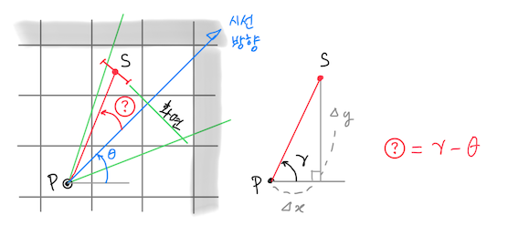
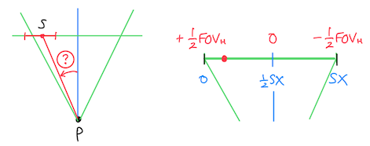
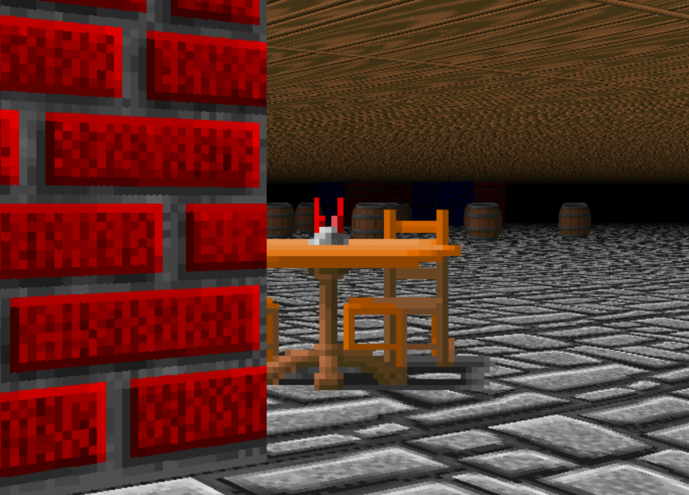
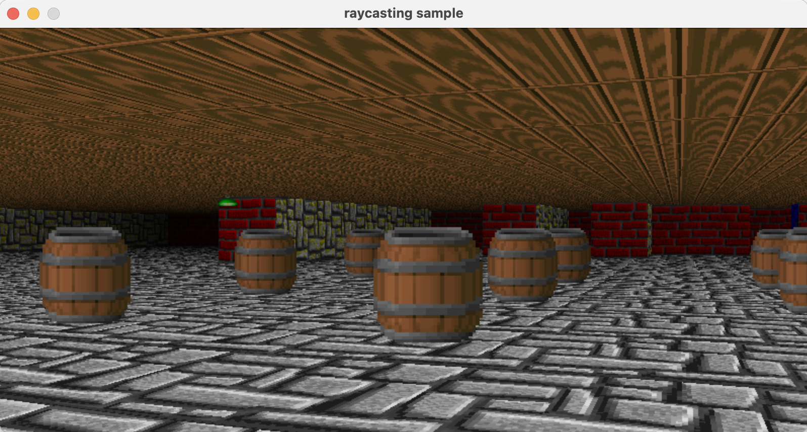

# Ray-casting 7: The Sprite

~ Joongbin's [Math Reboot](https://blog.insightbook.co.kr/2020/07/01/《수학-리부트-프로그래머를-위한-기초-수학》/) ~

~ [삼각함수, 벡터 관련 유튜브 강의 클립](https://www.youtube.com/channel/UC3oEhf5Q1WxgwK44Tc80RLw/playlists) ~

물통이나 기둥 같은 아이템, 적군 병사 등을 그리는 데 쓰이는 스프라이트는 여러가지 면에서 벽과 비슷합니다. 맵에서 셀 하나를 차지하는 것도 그렇고, 화면에서 벽 높이가 거리에 따라 정해지는 것처럼 스프라이트의 높이(와 너비)도 거리에 따라 정해집니다. 하지만 차이점도 있습니다.

- 스프라이트는 항상 플레이어 쪽을 향하도록 그린다
(안 그러면 360도 방향에서 봤을 때의 이미지를 전부 미리 준비해놔야..)
- 스프라이트에는 투명한 부분을 넣을 수 있다
(이것 때문에 화면이 좀 더 현실적으로 보이는 면이 있죠)

간단히 예를 들어서 아래 왼쪽 그림처럼 맵에 스프라이트를 몇 개 놓아 보겠습니다. 점(`.`)은 복도, `#`은 벽, `2` 이상의 숫자들은 스프라이트를 나타냅니다. 플레이어의 위치는 `@`로 표시되어 있습니다.

```c
# # # # # # # # #
# . 3 . . 3 2 2 #
# . . . . . . . #
# . . 4 . 4 . . #
# . . . @ . . . #
# . . . . . . . #
# . . . 5 . . 3 #
# # # # # # # # #
```

```c
# # # # # # # # #
# . 3 . . 3 2 2 #
# . . . . . . . #
# . . 4 . 4 . . #
# . . . @ . . . #
# . . . . . . . #
# . . . 5 . . 3 #
# # # # # # # # #
```

여기서 플레이어가 북동쪽, 그러니까 45° 방향을 바라보고 있다고 하겠습니다. 그러면, 시야각에 따라 조금 다를 수 있겠지만 대체로 `3` `2` `2` 라는 스프라이트들과 거기서 두 칸 밑의 `4` 정도가 시야에 들어올 겁니다 (오른쪽 그림). 맵의 크기나 스프라이트 개수가 어떻든지 간에, 시야를 벗어난 스프라이트들은 거들떠 볼 필요도 없겠죠.

시야 범위를 알아내려면 어떻게 하는 것이 좋을까요?

시야는 곧 빛줄기죠. 벽을 탐지하기 위해 빛줄기를 쏘아 보내면서 격자와의 교점들을 검사하던 시절이 있었습니다. [The Wall](02_The_Wall.md) 에서였던가요.. 그 검사를 하면서, 빛줄기가 지나는 셀마다 "얘는 눈에 보임"이라는 표시를 달면 되지 않을까요? 그러면 SX 개의 빛줄기가 모두 발사된 후에, 어떤 셀이 시야 범위에 있는지가 드러날 겁니다.

또 다른 고려사항으로는 스프라이트끼리의 원근관계가 있습니다. 시선 방향 쪽으로 여러 개의 스프라이트가 겹친다면, 가까이 있는 것이 더 멀리 있는 것을 가려야 합니다. 예컨대 위 그림에서는 플레이어 바로 앞에 놓인 `4`번 스프라이트 때문에 뒤쪽의 다른 스프라이트들이 (아마도 `2`로 표시된 것들이) 일부건 전부건 가려져야 하겠죠.

이 부분은, 시야범위 내의 스프라이트들을 거리 순으로 정렬하여 해결할 수 있습니다. 가장 멀리 있는 것부터 시작해서 가까운 쪽으로 하나씩 그려 가면, 화면의 픽셀 입장에서는 먼 것 위에 가까운 것이 overwrite 되므로 원근을 제대로 표현할 수가 있겠죠.

자, 이제 어느 스프라이트를 어떤 순서대로 그릴지가 정해졌습니다. 그러면 그 스프라이트 하나하나는 어떤 방법으로 화면에 그려야 할까요?

# 스프라이트: 거리와 각도

아래 그림처럼 중심점이 *S* 로 표시된 스프라이트 하나가 시야각의 왼쪽 경계 근처에 걸쳐 있는 상황을 가정해 보겠습니다. 스프라이트는 셀의 중앙에 위치한다고 보는 것이 합리적이므로, 맵 상의 좌표는 항상 (x.5, x.5) 형태겠죠. 두 점의 좌표를 아니까 플레이어 위치 *P* 에서 *S* 까지의 거리가 바로 나오고, 거리를 알면 스프라이트의 높이(=너비) 또한 벽 계산할 때처럼 쉽게 얻을 수 있습니다.



스프라이트를 어떤 크기로 화면에 그려야 할지 알았으니, 화면 어디쯤에 놓을 것인지만 정하면 되겠네요. 이건 그림에서 선분 *PS* 가 시선방향에 대해 얼마의 각도로 벌어져 있는가를 알아내는 것과도 같습니다. 맵에서 수평시야각 FOV_H에 해당하는 화면 상의 픽셀 개수가 `SX`이니까, 스프라이트의 위치를 각도로 알면 화면에서 어디에 그릴지가 나오죠.

시선방향의 각도 *θ* 는 이미 알고 있습니다. 선분 *PS* 가 *x* 축과 이루는 각을 *γ*(감마)라 한다면, 스프라이트 *S* 가 플레이어의 시선방향에 대해 이루는 각은 (*γ* - *θ*)가 됩니다. 그럼 *γ* 는 어떻게 구할까요?

다시 삼각함수를 출동시켜 봅니다. 위의 그림처럼, *P* 와 *S* 좌표간의 차이를 각각 Δ*x* 및 Δ*y* 라 두면, 탄젠트의 정의에 의해 다음이 성립합니다.

$$
\displaystyle \tan\gamma \ =\  \frac{\Delta y}{\Delta x}
$$

아. 탄젠트의 역함수를 쓰면 각 *γ* 가 나오겠군요.

$$
\displaystyle \gamma \ =\  \arctan \left( \frac{\Delta y}{\Delta x} \right)
$$

아크탄젠트 값을 제대로 구하려면, <math.h> 에서 제공하는 `atan2(y, x)` 함수를 써야 합니다. 왜 (Δ*y /* Δ*x*)라는 값 1개만으로 구하지 않고 굳이 2변수 함수를 쓰는지는.. 설명이 좀 길어져서.. 인터넷 검색을 추천합니다.

이제 원하는 각 (*γ* - *θ*) 의 크기를 구했으니, 스프라이트를 화면에 위치시켜 볼까요. 시선방향 기준으로 벌어진 각도를 알 때 화면상의 위치는, 아래 그림을 참고해서 간단한 일차식으로 구할 수 있습니다. 계산은 직접 해 보시는 게 좋겠네요.



# 스프라이트: 비트맵 찍기

지금까지 스프라이트 "중심점"의 위치를 잡는 작업을 열심히 했습니다. 이제 거리에 따라 계산된 스프라이트 "크기"에 의거하여.. 그 중심점의 좌우로 비트맵을 그려 가면 되겠죠. 스프라이트도 텍스쳐처럼 고정 크기의 비트맵으로 이루어져 있으니까요. 그러므로 스프라이트의 비트맵 처리는 텍스쳐 때와 거의 같습니다.

다만 이때 주의할 점이 하나 있습니다. 우리는 지금 벽, 바닥, 천정이 모두 그려진 위에다가 스프라이트를 그리고 있는데요. 벽 가장자리에 걸쳐 있는 스프라이트들이 문제가 됩니다. 이 때는 벽에 가리지 않는 부분만 비트맵을 그려 줘야 합니다. 아래 스샷에 나온 식탁을, 전체를 그리면 안 되고 벽에 가려지지 않은 부분만 그려야 한다는 거죠!



이처럼 스프라이트의 비트맵은 (벽 그릴 때처럼) 세로선 하나하나가 정말로 눈에 보이는지 일일이 따져야 합니다. 하지만 다행히 이건 별로 어렵지 않습니다. 스프라이트 세로선 하나가 벽의 뒤에 가렸는지 아닌지 알기 위해서는, 그 전에 벽을 그릴 때 "화면의" 각 *x* 좌표에 대해서 "해당 벽 세로선까지의 거리"를 미리 기록해두고 그걸 참조하면 됩니다 (이걸 [Z-buffering](https://ko.wikipedia.org/wiki/Z_버퍼링)이라고 부르는 모양입니다). 그러니까 화면상의 해당 *x* 좌표에서 스프라이트보다 벽이 더 가깝다면 그냥 넘어가는 거죠.

끝으로, 투명 부분의 처리에 대해 알아 보고 마무리하겠습니다. PNG처럼 투명 색상(알파 채널)에 대한 정보를 넣을 수 있는 비트맵 포맷도 있지만, 그렇지 않은 경우가 더 많습니다. 해서, 텍스쳐나 스프라이트 비트맵은 흔히 특정한 색상을 하나 정해 두고 이건 투명한거야~ 라고 짜고 칩니다. 이 색상은 정하기 나름일 테니, 일관되게 처리를 하려면 예를 들어 검정색으로 통일하는 것이 편하겠죠. 인터넷에서 주워 온 텍스쳐가 투명 부분이 보라색이라고요? 그림판 띄워서 비트맵 노가다 하면 되죠 ㅋ.

# 스프라이트: The Code

지금까지 설명한 것처럼, 스프라이트를 그리기 위해서는 벽을 그릴 때부터 일찌감치 뭔가 신경써야 할 일들이 좀 있습니다. 우선 빛줄기 쏠 때 지나치는 셀마다 "이 셀은 눈에 보임"이라는 표식을 달아 주는 건데요. 일단 이 표식을 담아둘 `MAPX * MAPY` 크기의 2차원 배열을 하나 만들어야 하겠죠. 이걸 `int** visible` 이라고 두겠습니다. 배열을 할당하거나 초기화하는 등의 코드는 생략합니다.

그러면 기존의 `get_wall_intersection()` 함수에서는, 아래와 같이 `visible[mapx][mapy]` 원소의 값을 `1`로 세트하는 한 줄만 추가하면 됩니다.

```c
bool
get_wall_intersection( double ray, ..(중략).., int** visible )
{
    ... /* 중간 생략 */

    while( !hit )
    {
        ...

        if( cell == CELL_WALL ) {   /* hit wall? */
            ...
        }
        visible[mapx][mapy] = 1;  /* 이 행을 추가 ! */

        if( hit_side == VERT ) nx += xstep;
        else ny += ystep;
    }
    /* end of while(!hit) */
```

두번째로 수정할 부분은, 빛줄기를 하나 쏴서 거리를 얻은 다음 그 결과를 어딘가에 (Z-buffer에) 저장해 두는 일입니다. 아래 코드에서는 `zbuf`라는 이름의 배열을 하나 만들고 `cast_single_ray()` 호출 직후에 리턴 값을 저장합니다. 벽, 천정, 바닥을 다 그린 다음에는, `zbuf`와 앞에서 채웠던 `visible` 배열을 가지고 이제 스프라이트 그리는 함수 `draw_sprites()`를 부릅니다.

```c
    double zbuf[SX]; /* distances to the wall slices */
    ...

    /* now cast some rays */
    for( int x=0; x<SX; x++ ) {
        double wdist = cast_single_ray(x, gr, pp, vis);
        zbuf[x] = wdist;
    }

    /* draw sprites using visibility & distances */
    draw_sprites(gr, pp, vis, zbuf);
```

본격적인 스프라이트 처리입니다. 원활한 진행을 위해서 구조체를 하나 정의해 쓰겠습니다.

```c
typedef struct {
    int tex;     /* texture bitmap no. */
    int x, y;    /* position in the map */
    double dist; /* distance from the player */
    double th;   /* angle */
} sprite_t;
```

첫 단계는, 현재 플레이어 위치에서 시야 범위에 들어오는 스프라이트들을 전부 모으는 일입니다. 이것을 `get_visible_sprites()`라는 함수로 만들어 봅니다. 코드 중에 CELL_WALL 어쩌고 나온 것은, enum 순서땜에 그런 겁니다. 맵에서 0=바닥, 1=CELL_WALL=벽, 2부터는 스프라이트라 정해서요.

아래 코드에서 특별히 언급할 만한 것은 별로 없지만.. 혹시나 해서 몇 개만 짚어 보면,

- `cmp_sprites()`는 `qsort()`에서 구조체를 정렬할 때 쓰는 비교용 함수임 (거리로 정렬)
- 스프라이트가 *x* 축과 이루는 각도는 `sp[n].th = atan2( ... )` 부분에서 계산하며, 결과가 음수일 경우 2π를 더하여 양수로 바꿔 둠
- 스프라이트-플레이어 간 거리 `sp[n].dist` 계산 시에는 벽과 마찬가지로 cos 값을 곱하여 거리를 보정함

```c
static int
cmp_sprites( const void* a, const void* b )
{
    return (((const sprite_t*)a)->dist > ((const sprite_t*)b)->dist) ? -1 : 1;
}

static sprite_t*
get_visible_sprites( player_t* pp, int** vis, int* pcnt )
{
    int n = 0;
    sprite_t* sp = NULL; /* dynamic array */

    /* build list of visible sprites */
    for( int x=0; x<map_xmax(); x++ ) {
        for( int y=0; y<map_ymax(); y++ ) {
            if( vis[x][y] == 0 || map_get_cell(x,y) <= CELL_WALL )
                continue;

            if( n == 0 ) sp = (sprite_t*) malloc(sizeof(sprite_t));
            else sp = (sprite_t*) realloc(sp, sizeof(sprite_t)*(n+1));

            sp[n].tex = (map_get_cell(x,y) - CELL_WALL) + 5;
            sp[n].x = x;
            sp[n].y = y;
            sp[n].th = atan2((y+0.5)-(pp->y), (x+0.5)-(pp->x));
            if( sp[n].th < 0 ) sp[n].th += _2PI;
            sp[n].dist = l2dist(pp->x, pp->y, x+0.5, y+0.5) * cos(pp->th - sp[n].th);
            n++;
        }
    }
    *pcnt = n;
    return sp;
}
```

다음 단계는, 이렇게 모아 온 가시범위 내의 스프라이트들을 `qsort()`로 정렬한 다음에, 멀리 있는 것부터 하나씩 화면에 그려 줍니다. 이때 벽에 가렸는지 여부는 `zbuf` 값으로 판단합니다.

아래 코드에서 메모해둘 것으로는..

- 스프라이트가 시선방향과 이루는 각 `angle`을 계산할 때는, 가운데를 0으로 하여 좌우 -π ~ +π 범위 내에 있도록 조정해 줌
- 투명 색상은 검정색(0x0)으로 정하며, 어떤 색상이 검정인지 알아볼 때는 안전하게 비트마스킹을 써서 `if( (color & 0x00ffffff) == 0 )` 처럼 함

```c
static const double PIXEL_PER_ANGLE = (SX-1.) / FOV_H;

static void
draw_sprites( void* gr, player_t* pp, int** vis, double zbuf[SX] )
{
    int nsp = 0;
    sprite_t* sp = get_visible_sprites(pp, vis, &nsp);

    qsort(sp, nsp, sizeof(sprite_t), cmp_sprites);  /* order by dist DESC */

    for( int i=0; i<nsp; i++ ) {
        int sh = get_wall_height(sp[i].dist); /* sprite height (=width) */
        double lum = get_luminosity(sp[i].dist);
        img_t* ptex = texture_get(sp[i].tex);

        double angle = sp[i].th - pp->th; /* angle of sprite relative to FOV center */
        if( angle > M_PI ) angle -= _2PI;   /* ensures -pi < angle < +pi */
        else if( angle < -M_PI ) angle += _2PI;

        int cx = (int)((FOVH_2 - angle) * PIXEL_PER_ANGLE); /* screen pos of sprite, in pixels */
        int xmin = max(0, cx - sh/2); /* clipping */
        int xmax = min(SX, cx + sh/2);

        for( int x=xmin; x<xmax; x++ ) {
            if( sp[i].dist > zbuf[x] ) continue; /* behind wall */
            if( sp[i].dist < PL_RADIUS ) continue; /* too close */

            double txratio = (double)(x-cx)/sh + 0.5;
            int tx = (int)(txratio * ptex->w); /* texture col # */
            int y0 = (int)((SY - sh)/2.0);

            for( int y=max(0, y0); y<min(SY, y0+sh); y++ ) {
                int ty = (int)((double)(y-y0) * ptex->h / sh); /* texture row # */
                int color = gr_img_getpixel(ptex, tx, ty);
                if( (color & 0x00ffffff) == 0 ) continue; /* black == transparent */
                gr_putpixel(gr, x, y, fade_color(color, lum));
            }
        }
    }
    if( nsp > 0 ) free(sp);
}
```

자.. 스샷 한번 보고 가실께요..




드디어 스프라이트까지 다 그렸습니다. 더 해볼만한 꺼리를 찾으려면 계속 찾아지겠지만, 어쨌거나 매듭은 한번 지어야죠. 이것으로 레이-캐스팅 구현은 마무리 하겠습니다. 🎉🎉🎉

긴 글 읽어주셔서 고맙습니다.

&#8592; [Ray-casting 6: The Floor](06_The_Floor.md)

&#8594; [Ray-casting sample run (GIF)](0x_Sample_Run.md)

