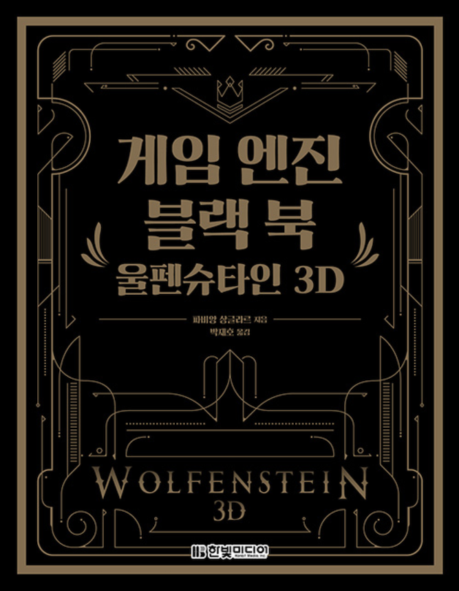
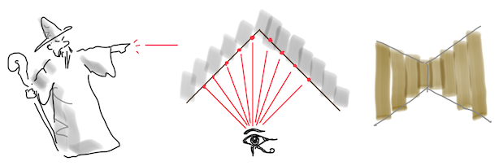

# 고1 수학으로 레이-캐스팅

~ Joongbin's [Math Reboot](https://blog.insightbook.co.kr/2020/07/01/《수학-리부트-프로그래머를-위한-기초-수학》/) ~

~ [삼각함수, 벡터 관련 유튜브 강의 클립](https://www.youtube.com/channel/UC3oEhf5Q1WxgwK44Tc80RLw/playlists) ~

온라인 서점의 IT분야 코너를 뒤적이던 어느 날, 심상치 않은 포스를 풍기는 책 한 권이 눈에 들어왔습니다.

> "게임 엔진 블랙 북 : 울펜슈타인 3D" \
    파비앙 상글라르 저 / 박재호 역 / 한빛미디어 (2020)

겉모습만으로는 장르 판정이 약간 아리송했지만, 목차를 들여다 보니 정체가 명확해집니다.
FPS의 원조라 할 수 있는 울펜슈타인3D 게임이 만들어진 과정을, 개발 관점에서 시시콜콜하게 파헤쳐 주는군요. 음... 그러니까 예상보다도 더 시시콜콜하게!

이건 어떻게 생각해도 독자층이 두터울 수가 없는데?
오지랖이 발동하여 책의 판매 부수가 잠깐 걱정되기도 했지만, 그래도 뭐 리뷰를 보니 찾는 사람이 제법 있는 듯합니다.

개발사 이드(id)소프트웨어는 예전에 꽤나 재미있게 했던 Commander Keen이나 Doom, Heretic 류의 게임으로 친숙하기도 하고,
존 카맥 같은 개발자들이 [fast inverse sqrt](https://ko.wikipedia.org/wiki/%EA%B3%A0%EC%86%8D_%EC%97%AD_%EC%A0%9C%EA%B3%B1%EA%B7%BC) 등의 가십으로
개발 동네에서 명성도 있는지라, 재미있겠다 싶어 냉큼 책을 주문했습니다.

사실 당시에 울펜3D 게임을 하면서 가장 궁금했던 것은, 대체 무슨 짓을 했길래 386급 PC에서 무려 3차원 그래픽(처럼 보이는) 화면을 버벅거림도 없이 구현해낼 수 있었나 하는 것이었습니다. 알고 보니 그것은 3D인 척하는 2D 기법이었고, 레이-캐스팅(ray-casting)이라는 이름을 가지고 있는 모양입니다. 레이-트레이싱(ray-tracing)이라면 그래픽스 하는 친구들 어깨너머로 구경한 적이 있어도 레이-캐스팅은 어째 낯이 서네요.

레이캐스팅에 대해 좀 더 알아보려고 위의 까만 책을 비롯하여 이런저런 인터넷 자료를 검색해 보니 대략 감이 잡힙니다. 그런데 누군지 몰라도 이름은 잘 지은 것 같군요. ray를 cast한다니..

RPG 등에서 마법을 시전하는 것은 영어로 cast a spell 이라 쓰죠. 법사가 주문을 외며 손을 뻗을 때 파이어볼 같은 것이 나가는 모양을 상상하면 되겠습니다. 이제 주문(spell) 대신에 빛줄기(ray)를 쏘면, 그게 cast a 'ray' 즉 레이-캐스팅입니다.

다만 이 때 빛줄기는 마구잡이로 쏘는 게 아니라 잘 조절해야 하는데, 컴퓨터 화면의 가로 픽셀 개수만큼 빛줄기를 균등한 간격으로 쏘아 보내야 합니다. 그러니까 풀HD 화면이 타겟이라면 1920개의 ray를 cast하는 것이죠.

이 빛줄기 다발을 쏘는 이유는, 마치 박쥐가 초음파로 주변을 인식하듯이 플레이어 앞에 놓인 벽의 모양을 알아내기 위함입니다. 쏘아 보낸 각각의 빛줄기가 벽에 부딪히면, 그 거리를 계산해서 원근법에 따라 해당 벽을 화면에 그려 주는 것이 레이캐스팅의 핵심이고요. 이때 빛줄기 하나는 1픽셀 두께이니 거기 부딪히는 것은 ’벽’이라기보다 벽을 구성하는 '세로줄'이라 불러야 할 듯합니다.

화면의 가로 픽셀 하나당 빛줄기 하나가 발사되었으므로, 빛줄기 하나는 풀HD 화면으로 치면 1 x 1080 영역을 커버하게 됩니다. 이제 이렇게 위아래로 늘어선 1080 픽셀을 가지고, 어떤 세로줄은 예를 들어 좀 가까이 있으니까 가운데 정렬해서 800 픽셀만큼 칠하고, 또 다른 세로줄은 예를 들어 좀 멀리 있으니까 200 픽셀만 칠해 봅니다.

그 최종 결과는 어떨까요? 원근법이 적용된 1픽셀 두께의 ’세로줄’들이 좌우로 쭉 늘어선 화면이 될 것이고, 우리 눈은 이것을 3차원 공간에서 벽을 마주한 장면이라고 인식할 겁니다... 자, ’거리’의 차이가 느껴지십니까 휴먼? (끄덕)

레이캐스팅의 큰 틀은 이해했지만, 실제 구현은 어떨까요? 구체적인 레벨로 들어가면 고려해야 할 것들이 더 많이 나올 터입니다. 인터넷을 뒤져 보니 대략 두 개의 자료가 나름의 권위(?)를 가지고 자주 참조되는 것 같네요.

- [Permadi’s Ray-Casting Tutorial](https://permadi.com/1996/05/ray-casting-tutorial-table-of-contents/)
- [Lode Vandevenne’s Raycasting Tutorial](https://lodev.org/cgtutor/raycasting.html)

Permadi 자료는 1996년(!!)산이고 구체적인 코드가 아니라 pseudo-code로 설명되어 있지만, 전체적으로 보아 상당히 이해하기 쉽게 작성되었다는 느낌을 줍니다. 다만 물통, 기둥 같은 ’아이템’들 - 즉 ’sprite’에 대한 설명은 빠져 있는 것이 아쉽네요.

그와 대비하여 Lode의 자료는 여러가지 sprite들과 문짝 등 좀 더 다양한 내용을 다루지만, 벡터와 행렬을 사용하는 공간기하(...기벡!)로 설명하는 탓에 따라가기가 쉽지는 않아 보입니다. 요즘은 고등학교에서 벡터도 안 가르친다던데..

레이캐스팅 구현에 굳이 기벡까지 동원할 필요는 없을 거라는 느낌적 느낌이 드네요. 일단은 ’블랙 북’과 Permadi 자료를 참고해서, 원래 울펜3D가 그랬던 것처럼 C 언어로 이 레이캐스팅이란 것을 만들어 볼까 합니다. 왠지 간만에 재밌을 것 같은 예감이 드는군요..!

이후의 글에서는 아래와 같은 스펙의 레이캐스팅을 구현하면서, 겉으로 보이는 코드 뒤의 '실체적 진실'이라 할 수 있는 수학적 배경을 함께 짚어 보려고 합니다.

- [Ray-casting 1: The World](01_The_World.md)
- [Ray-casting 2: The Wall](02_The_Wall.md)
- [Ray-casting 3: The Height](03_The_Height.md)
- [Ray-casting 4: The Player](04_The_Player.md)
- [Ray-casting 5: The Texture (feat. Lumi)](05_The_Texture.md)
- [Ray-casting 6: The Floor](06_The_Floor.md)
- [Ray-casting 7: The Sprite](07_The_Sprite.md)
- [Ray-casting sample run (GIF)](0x_Sample_Run.md)

